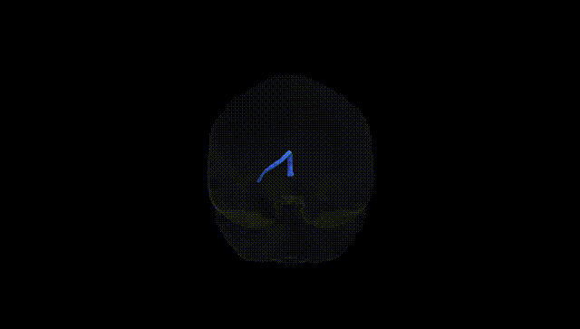
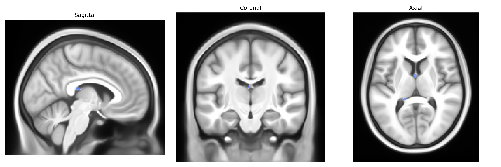

# Fornix left

## Overview

The left fornix is a C-shaped white matter tract in the left hemisphere that constitutes the major efferent pathway of the hippocampal formation, running from the subiculum and hippocampus through the fimbria and crura to the body of the fornix and projecting primarily to the mammillary bodies and septal nuclei. It plays a critical role in episodic memory, spatial navigation, and limbic integration by transmitting hippocampal output to diencephalic and basal forebrain structures, forming a key component of the Papez circuit. Damage or degeneration of the left fornix has been associated with memory impairment, including anterograde amnesia and deficits in verbal memory, and is frequently investigated in the context of neurodegenerative diseases, epilepsy, and traumatic brain injury. There is no direct Wikipedia page specifically for the “left fornix” as a separate entity; a closely related structure with detailed information is the general fornix: https://en.wikipedia.org/wiki/Fornix_(neuroanatomy)

*Overview generated by GPT-4o (2026).*

---

**Region ID:** 19  
**Hemisphere:** left  
**Atlas:** Pandora-TractSeg 

---

## Fornix left – Black Background (Full Brain)

**Full Quality Version:** [Download MP4](full_black.mp4)

---

## Fornix left – White Background (Full Brain)

**Full Quality Version:** [Download MP4](full_white.mp4)

---

## Fornix left – Black Background (Hemisphere)

**Full Quality Version:** [Download MP4](hemi_black.mp4)

---

## Fornix left – White Background (Hemisphere)

**Full Quality Version:** [Download MP4](hemi_white.mp4)

---

## Triplanar View – T1 Background

---

## Triplanar View – Ghost Brain


