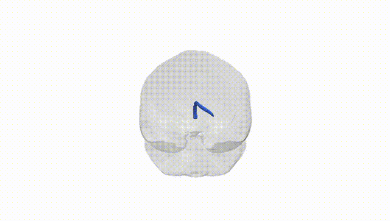
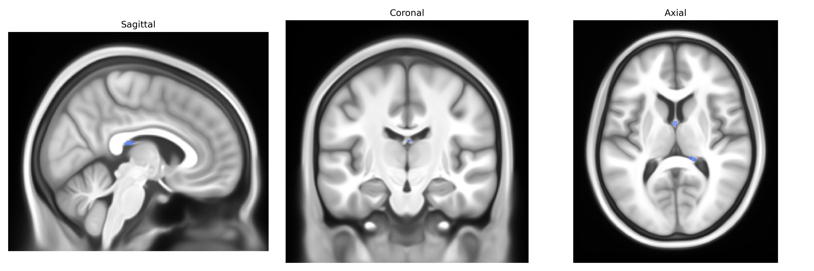

# Fornix right

## Overview

The Fornix right is the right-sided component of the fornix, a C-shaped white matter tract in the limbic system that serves as a major efferent pathway from the hippocampal formation to subcortical structures such as the mammillary bodies and septal nuclei. It originates primarily from pyramidal neurons in the hippocampus (especially the subiculum), whose axons converge in the fimbria, arch superiorly beneath the corpus callosum as the body of the fornix, and then descend anteriorly as the columns of the fornix, with the right tract coursing ipsilaterally. This pathway is critical for episodic memory processing and consolidation, facilitating communication between medial temporal lobe structures and diencephalic and basal forebrain targets. Damage or degeneration of the fornix, including its right segment, has been associated with memory impairment and is of interest in neurodegenerative and neurosurgical contexts. [Fornix (brain)](https://en.wikipedia.org/wiki/Fornix_(brain))

Current genetic knowledge specifically targeting the right fornix tract as defined in the Pandora-TractSeg Atlas is very limited; most genetic findings concern the fornix as a whole or limbic white matter rather than tract- and hemisphere-specific effects. Large diffusion MRI GWAS, including UK Biobank–based studies, have identified common variants associated with diffusion tensor imaging metrics (especially fractional anisotropy and mean/radial diffusivity) in fornix-related regions, often implicating genes involved in axonal guidance, myelination, and neurodevelopment (for example, loci near genes such as NTRK1/2, CNTN4/6, and various oligodendrocyte-related genes), but these results are generally reported at the level of broader fornix or limbic projections. Fornix microstructure metrics show heritability and have been linked in imaging–genetics or polygenic score studies to Alzheimer’s disease risk, general cognitive ability, memory performance, and schizophrenia or psychosis risk, yet these findings typically do not isolate the right fornix as an independent genetic target. To date, no robust, replicated GWAS has been published that reports tract-specific, hemisphere-specific genetic associations uniquely for the “fornix right” tract as labeled in the Pandora-TractSeg Atlas, and existing results should be interpreted as applying to fornix or limbic white matter more generally rather than to this atlas-defined tract in isolation.

*Overview generated by GPT-4o (2026).*

---

**Region ID:** 20  
**Hemisphere:** right  
**Atlas:** Pandora-TractSeg 

---

## Fornix right – Black Background (Full Brain)

**Full Quality Version:** <a href="full_black.mp4" download>Download MP4</a>

---

## Fornix right – White Background (Full Brain)

**Full Quality Version:** <a href="full_white.mp4" download>Download MP4</a>

---

## Triplanar View – T1 Background

---

## Triplanar View – Ghost Brain


