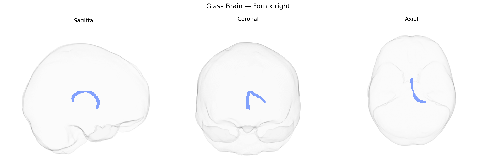

# Fornix right

## Overview

The right fornix is a major white matter tract of the right cerebral hemisphere that forms the primary efferent pathway from the hippocampal formation to subcortical structures, including the mammillary bodies, septal nuclei, and anterior thalamic regions. Arising predominantly from the pyramidal neurons of the hippocampus and subiculum, its fibers arch superiorly and medially beneath the corpus callosum, forming the crura and body of the fornix before descending anteriorly as the columns of the fornix. Functionally, the right fornix is critically involved in episodic memory, spatial navigation, and limbic network integration, contributing to the Papez circuit and broader medial temporal lobe memory systems. Lesions or microstructural alterations in this tract are associated with memory impairment and have been implicated in conditions such as Alzheimer’s disease, traumatic brain injury, and temporal lobe epilepsy. There is no direct Wikipedia page for the “right fornix” as a separate entity; a related and encompassing structure is described at: https://en.wikipedia.org/wiki/Fornix_(brain)

*Overview generated by GPT-4o (2026).*

---

**Region ID:** 20  
**Hemisphere:** right  
**Atlas:** Pandora-TractSeg 

---

## Fornix right – Black Background (Full Brain)

**Full Quality Version:** [Download MP4](full_black.mp4)

---

## Fornix right – White Background (Full Brain)

**Full Quality Version:** [Download MP4](full_white.mp4)

---

## Fornix right – Black Background (Hemisphere)

**Full Quality Version:** [Download MP4](hemi_black.mp4)

---

## Fornix right – White Background (Hemisphere)

**Full Quality Version:** [Download MP4](hemi_white.mp4)

---

## Triplanar View – T1 Background

---

## Triplanar View – Ghost Brain


