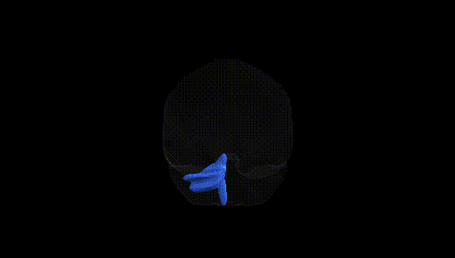
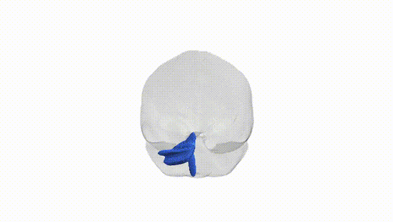
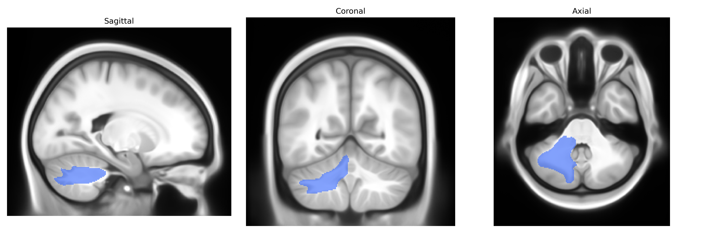
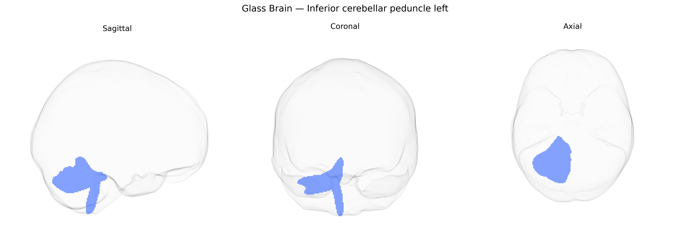

# Inferior cerebellar peduncle left

## Overview

The left inferior cerebellar peduncle is a major white matter tract connecting the medulla oblongata and spinal cord to the cerebellum, primarily conveying afferent sensory and modulatory information important for balance, posture, and coordination of movement. It carries inputs from the dorsal spinocerebellar, cuneocerebellar, olivocerebellar, vestibulocerebellar, and reticulocerebellar pathways, transmitting proprioceptive and vestibular signals that allow the cerebellar cortex and deep nuclei to fine‑tune motor output and maintain equilibrium. Lesions of this pathway can result in ipsilateral ataxia, dysmetria, and gait disturbances due to disruption of these sensorimotor feedback loops. There is no direct Wikipedia link for the “left inferior cerebellar peduncle” as a separate entry; a closely related and encompassing structure is the inferior cerebellar peduncle: https://en.wikipedia.org/wiki/Inferior_cerebellar_peduncle

*Overview generated by GPT-4o (2026).*

---

**Region ID:** 21  
**Hemisphere:** left  
**Atlas:** Pandora-TractSeg 

---

## Inferior cerebellar peduncle left – Black Background (Full Brain)

**Full Quality Version:** [Download MP4](full_black.mp4)

---

## Inferior cerebellar peduncle left – White Background (Full Brain)

**Full Quality Version:** [Download MP4](full_white.mp4)

---

## Inferior cerebellar peduncle left – Black Background (Hemisphere)

**Full Quality Version:** [Download MP4](hemi_black.mp4)

---

## Inferior cerebellar peduncle left – White Background (Hemisphere)

**Full Quality Version:** [Download MP4](hemi_white.mp4)

---

## Triplanar View – T1 Background

---

## Triplanar View – Ghost Brain


