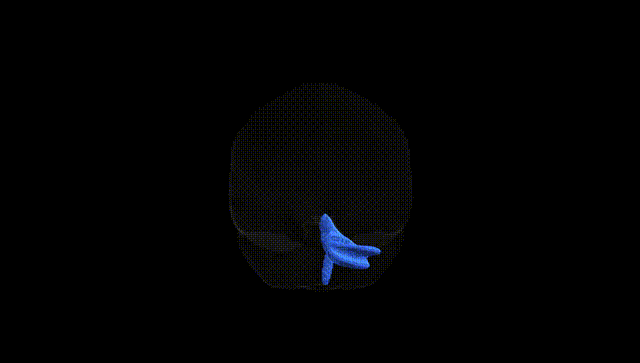
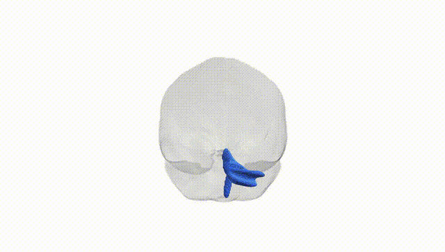
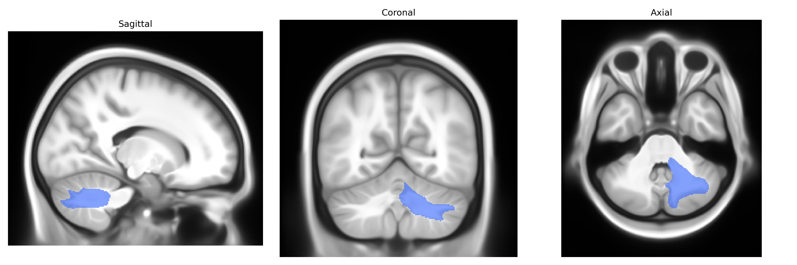

# Inferior cerebellar peduncle right

## Overview

The inferior cerebellar peduncle (ICP) is a major white matter tract connecting the medulla oblongata and spinal cord with the cerebellum, primarily conveying afferent sensory and modulatory information essential for balance, posture, and coordination of movement. It contains fibers from the dorsal spinocerebellar, cuneocerebellar, olivocerebellar, vestibulocerebellar, and reticulocerebellar pathways, which carry proprioceptive input from the body and head, as well as signals from the inferior olivary nucleus and vestibular nuclei. Structurally, the ICP enters the cerebellum through its caudal aspect and terminates mainly in the vermis and intermediate hemispheres, contributing to the integration of somatosensory and vestibular information for fine-tuning motor output. In the Pandora-TractSeg Atlas, the inferior cerebellar peduncle is delineated as a distinct infratentorial white matter tract, highlighting its trajectory from the dorsolateral medulla into the cerebellar cortex and deep cerebellar nuclei. There is no direct link for this specific tract; see instead the related structure [Cerebellar peduncle](https://en.wikipedia.org/wiki/Cerebellar_peduncle).

As of current literature, there are no robust, tract-specific genetic association findings published for the right inferior cerebellar peduncle as defined in the Pandora-TractSeg Atlas, and this structure is generally subsumed within broader cerebellar or brainstem white matter regions in imaging genetics studies. Large diffusion MRI GWAS (e.g., UK Biobank–based studies) have identified numerous loci influencing fractional anisotropy, mean diffusivity, and related metrics across cerebellar and brainstem tracts, but these typically aggregate measures at the level of major bundles or global cerebellar white matter rather than isolating the inferior cerebellar peduncle on the right side. Some polygenic influences on cerebellar white matter microstructure have been implicated in traits such as general cognitive ability, educational attainment, neurodevelopmental and psychiatric disorders, and motor coordination, yet these associations are not resolved down to this specific tract in a consistent, replicated manner. Consequently, the genetic architecture of diffusion properties specifically within the right inferior cerebellar peduncle, and its direct links to particular disorders or traits, remains largely uncharacterized in the current GWAS literature.

*Overview generated by GPT-4o (2026).*

---

**Region ID:** 22  
**Hemisphere:** right  
**Atlas:** Pandora-TractSeg 

---

## Inferior cerebellar peduncle right – Black Background (Full Brain)

**Full Quality Version:** <a href="full_black.mp4" download>Download MP4</a>

---

## Inferior cerebellar peduncle right – White Background (Full Brain)

**Full Quality Version:** <a href="full_white.mp4" download>Download MP4</a>

---

## Triplanar View – T1 Background

---

## Triplanar View – Ghost Brain


