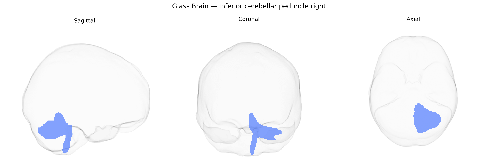

# Inferior cerebellar peduncle right

## Overview

The right inferior cerebellar peduncle is a major white matter tract connecting the medulla oblongata and spinal cord with the right cerebellar hemisphere, carrying predominantly afferent fibers involved in proprioception, vestibular input, and somatosensory information critical for the coordination of movement and balance. Principal components include the dorsal spinocerebellar tract, cuneocerebellar fibers, olivocerebellar fibers from the inferior olive, vestibulocerebellar fibers, and reticulocerebellar projections, which terminate mainly in the cerebellar cortex of the vermis and intermediate zones. Functionally, this tract supports fine-tuning of limb movements, posture control, and integration of sensory feedback necessary for smooth, adaptive motor output; lesions in the right inferior cerebellar peduncle can result in ipsilateral ataxia, dysmetria, and gait disturbances. The Pandora-TractSeg Atlas identifies this structure as a distinct tractographic entity based on diffusion MRI, delineating its course and connectivity within the larger cerebello-brainstem network. There is no direct Wikipedia page specifically for the “right inferior cerebellar peduncle”; a closely related and encompassing structure is described here: https://en.wikipedia.org/wiki/Inferior_cerebellar_peduncle

*Overview generated by GPT-4o (2026).*

---

**Region ID:** 22  
**Hemisphere:** right  
**Atlas:** Pandora-TractSeg 

---

## Inferior cerebellar peduncle right – Black Background (Full Brain)

**Full Quality Version:** [Download MP4](full_black.mp4)

---

## Inferior cerebellar peduncle right – White Background (Full Brain)

**Full Quality Version:** [Download MP4](full_white.mp4)

---

## Inferior cerebellar peduncle right – Black Background (Hemisphere)

**Full Quality Version:** [Download MP4](hemi_black.mp4)

---

## Inferior cerebellar peduncle right – White Background (Hemisphere)

**Full Quality Version:** [Download MP4](hemi_white.mp4)

---

## Triplanar View – T1 Background

---

## Triplanar View – Ghost Brain


