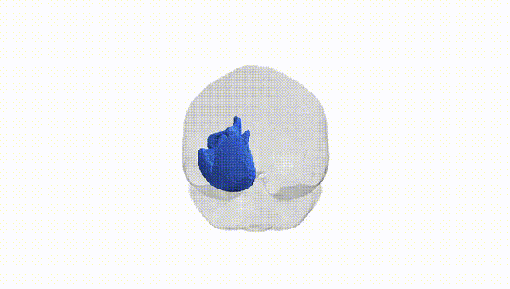
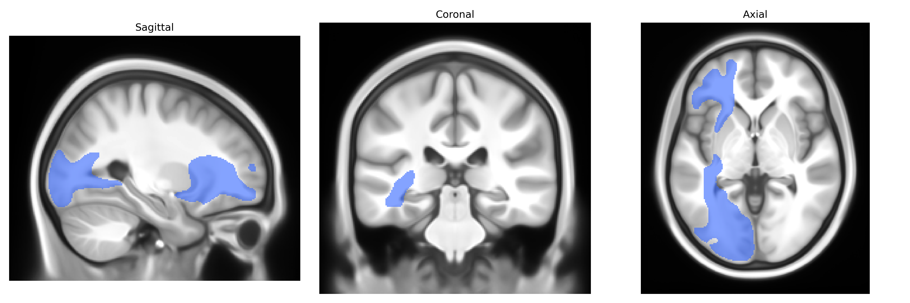

# Inferior occipito-frontal fascicle left

## Overview

The Inferior occipito-frontal fascicle (left) is a long associative white matter tract that connects the occipital and posterior temporal cortices with anterior temporal, parietal, and prefrontal regions within the left hemisphere. Running predominantly in the ventral part of the brain, it courses from the occipital lobe through the temporal and parietal white matter toward the frontal lobe, contributing to networks subserving visual processing, semantic integration, language, and higher-order cognition. This tract forms part of the ventral stream pathways that support object recognition and the integration of visual information with linguistic and conceptual representations. In many neuroanatomical sources it is often grouped or discussed together with the inferior fronto-occipital fasciculus, a closely related or overlapping pathway in the ventral associative system. There is no direct link; see the related [Inferior fronto-occipital fasciculus](https://en.wikipedia.org/wiki/Inferior_fronto-occipital_fasciculus).

Current genetic knowledge specifically targeting the left inferior fronto‑occipital fasciculus (IFOF) as defined in the Pandora‑TractSeg Atlas is limited, and no widely replicated, tract‑exclusive genome‑wide association studies (GWAS) have been reported for this exact region. Large diffusion MRI GWAS consortia (e.g., ENIGMA, UK Biobank–based studies) have identified numerous common variants associated with global and regional white matter microstructure (fractional anisotropy, mean diffusivity, and related metrics) that include association signals in or near tracts such as the IFOF, but these are typically reported at the level of broader association fiber systems or aggregated principal components rather than the left IFOF alone. Genes and loci implicated in axon guidance, myelination, and oligodendrocyte biology (for example, variants near genes like NRG1, MAG, and others) have been broadly associated with white matter integrity in association tracts and with disorders involving fronto‑occipital connectivity, including schizophrenia, bipolar disorder, and major depressive disorder, yet attribution to the left IFOF in particular remains indirect and model‑based. Similarly, polygenic risk for neurodevelopmental and psychiatric conditions has been associated with altered diffusion metrics in large‑scale imaging genetics studies, but again at a level that does not isolate the left IFOF. Overall, while the IFOF is functionally and clinically important and is certainly encompassed within global white matter genetic signals, tract‑specific genetic associations for the left inferior occipito‑frontal fascicle as defined in Pandora‑TractSeg remain sparse and poorly characterized in the current literature.

*Overview generated by GPT-4o (2026).*

---

**Region ID:** 23  
**Hemisphere:** left  
**Atlas:** Pandora-TractSeg 

---

## Inferior occipito-frontal fascicle left – Black Background (Full Brain)

**Full Quality Version:** <a href="full_black.mp4" download>Download MP4</a>

---

## Inferior occipito-frontal fascicle left – White Background (Full Brain)

**Full Quality Version:** <a href="full_white.mp4" download>Download MP4</a>

---

## Triplanar View – T1 Background

---

## Triplanar View – Ghost Brain


