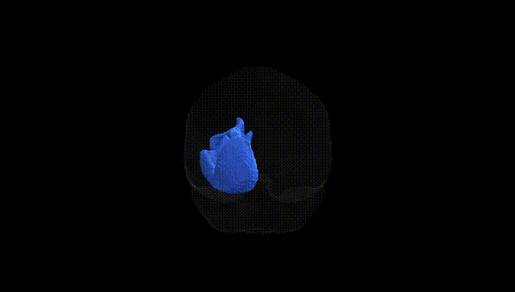
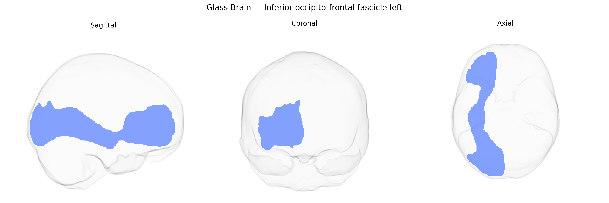

# Inferior occipito-frontal fascicle left

## Overview

The left inferior occipito-frontal fascicle (often corresponding to the left inferior fronto-occipital fasciculus, IFOF) is a major association white matter tract connecting occipital and posterior temporal regions with the frontal lobe, coursing through the ventral part of the brain and passing lateral to the caudate nucleus and medial to the insula within the external/extreme capsule region. Functionally, it is implicated in higher-order visual processing, language and semantic processing, reading, and aspects of attention and executive control by integrating visual information with frontal cognitive systems. In the Pandora-TractSeg Atlas, this tract is defined probabilistically based on diffusion MRI tractography and represents the left-hemisphere homolog of a bilateral system critical for long-range anteroposterior cortical communication. There is no direct Wikipedia link for the left Inferior occipito-frontal fascicle as defined in the Pandora-TractSeg Atlas; a closely related structure is the inferior fronto-occipital fasciculus: https://en.wikipedia.org/wiki/Inferior_fronto-occipital_fasciculus.

*Overview generated by GPT-4o (2026).*

---

**Region ID:** 23  
**Hemisphere:** left  
**Atlas:** Pandora-TractSeg 

---

## Inferior occipito-frontal fascicle left – Black Background (Full Brain)

**Full Quality Version:** [Download MP4](full_black.mp4)

---

## Inferior occipito-frontal fascicle left – White Background (Full Brain)

**Full Quality Version:** [Download MP4](full_white.mp4)

---

## Inferior occipito-frontal fascicle left – Black Background (Hemisphere)

**Full Quality Version:** [Download MP4](hemi_black.mp4)

---

## Inferior occipito-frontal fascicle left – White Background (Hemisphere)

**Full Quality Version:** [Download MP4](hemi_white.mp4)

---

## Triplanar View – T1 Background

---

## Triplanar View – Ghost Brain


