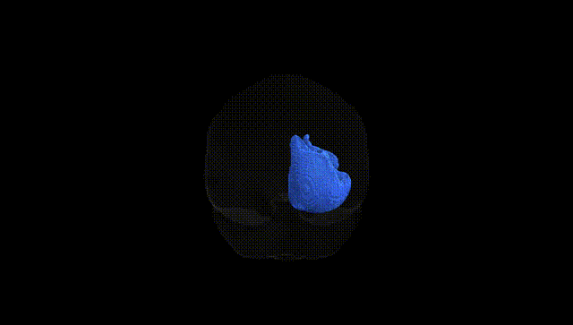
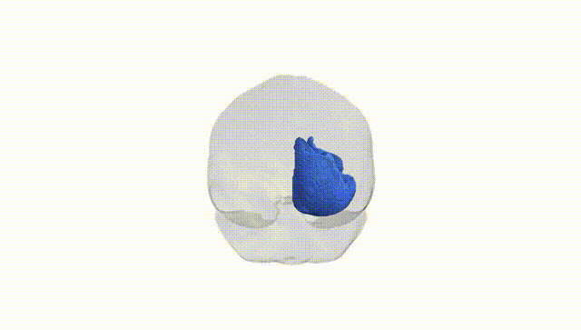
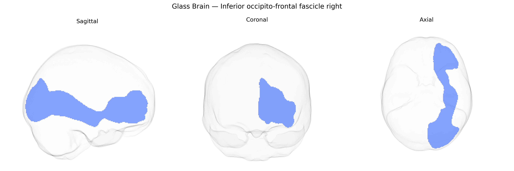

# Inferior occipito-frontal fascicle right

## Overview

The Inferior occipito-frontal fascicle right (commonly termed the right inferior fronto-occipital fasciculus, IFOF) is a major associative white matter tract that links occipital and posterior temporal regions with the frontal lobe through a ventral pathway. Originating primarily in the occipital cortex and posterior temporal areas, its fibers course anteromedially through the temporal lobe and external/extreme capsule region, passing medial to the insula and lateral to the basal ganglia, before terminating in the orbitofrontal, dorsolateral prefrontal, and inferior frontal cortices. This tract is implicated in higher-order visual processing, semantic and language functions, and aspects of attention and executive control, serving as a critical conduit between visual-perceptual systems and frontal integrative regions. There is no direct Wikipedia article for this exact atlas label; a related structure description can be found at [Inferior fronto-occipital fasciculus](https://en.wikipedia.org/wiki/Inferior_fronto-occipital_fasciculus).

Current literature provides very limited tract-specific genetic information for the right inferior occipito-frontal fascicle (often overlapping with or subsumed under the inferior fronto-occipital fasciculus, IFOF) as defined in the Pandora-TractSeg Atlas. Large diffusion MRI GWAS have demonstrated substantial heritability and identified numerous loci for white-matter microstructural metrics such as fractional anisotropy (FA) and mean diffusivity (MD) across association tracts, but most report results at the level of tract classes or broader fasciculi rather than the specific right IFOF segment in this atlas. Several studies implicate genes involved in axon guidance, myelination, and oligodendrocyte function (e.g., variants near genes like NCAM1, ROBO1/2, MAG, and others) in modulating association-tract integrity, and altered FA/MD in IFOF-like regions has been reported in schizophrenia, bipolar disorder, major depressive disorder, autism spectrum disorder, and dyslexia; however, direct genotype–phenotype links specifically assigning risk variants to the right inferior occipito-frontal fascicle in Pandora-TractSeg are not well established. At present, genetic findings relevant to this tract are largely extrapolated from broader white-matter and association-fiber GWAS rather than from studies explicitly targeting this exact pathway, and precise tract-specific associations remain poorly characterized.

*Overview generated by GPT-4o (2026).*

---

**Region ID:** 24  
**Hemisphere:** right  
**Atlas:** Pandora-TractSeg 

---

## Inferior occipito-frontal fascicle right – Black Background (Full Brain)

**Full Quality Version:** <a href="full_black.mp4" download>Download MP4</a>

---

## Inferior occipito-frontal fascicle right – White Background (Full Brain)

**Full Quality Version:** <a href="full_white.mp4" download>Download MP4</a>

---

## Triplanar View – T1 Background

---

## Triplanar View – Ghost Brain


