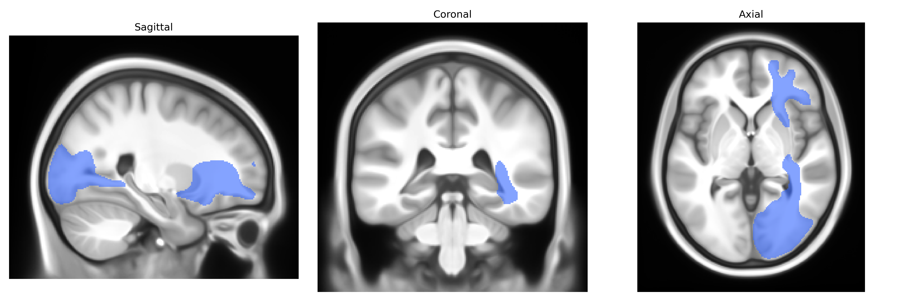

# Inferior occipito-frontal fascicle right

## Overview

The right inferior occipito-frontal fascicle (often corresponding to the inferior fronto-occipital fasciculus, IFOF) is a major associative white matter tract in the right cerebral hemisphere that connects occipital and posterior temporal regions with the frontal lobe, coursing through the deep white matter of the temporal and parietal lobes and traversing the external/extreme capsule region. It plays a role in high-level visual processing, semantic and language-related integration, and aspects of attention and executive control by enabling long-range communication between visual association cortices and prefrontal areas. The tract’s right-hemispheric component is particularly implicated in visuospatial processing, integration of visual information with executive functions, and possibly nonverbal semantic processing, although its precise functional specialization remains a subject of ongoing research. There is no direct Wikipedia link for the “right inferior occipito-frontal fascicle” as labeled in the Pandora-TractSeg Atlas; a closely related structure is the inferior fronto-occipital fasciculus: https://en.wikipedia.org/wiki/Inferior_fronto-occipital_fasciculus

*Overview generated by GPT-4o (2026).*

---

**Region ID:** 24  
**Hemisphere:** right  
**Atlas:** Pandora-TractSeg 

---

## Inferior occipito-frontal fascicle right – Black Background (Full Brain)

**Full Quality Version:** [Download MP4](full_black.mp4)

---

## Inferior occipito-frontal fascicle right – White Background (Full Brain)

**Full Quality Version:** [Download MP4](full_white.mp4)

---

## Inferior occipito-frontal fascicle right – Black Background (Hemisphere)

**Full Quality Version:** [Download MP4](hemi_black.mp4)

---

## Inferior occipito-frontal fascicle right – White Background (Hemisphere)

**Full Quality Version:** [Download MP4](hemi_white.mp4)

---

## Triplanar View – T1 Background

---

## Triplanar View – Ghost Brain


