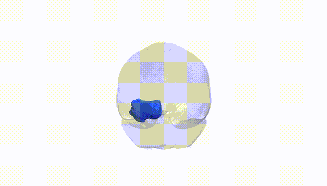
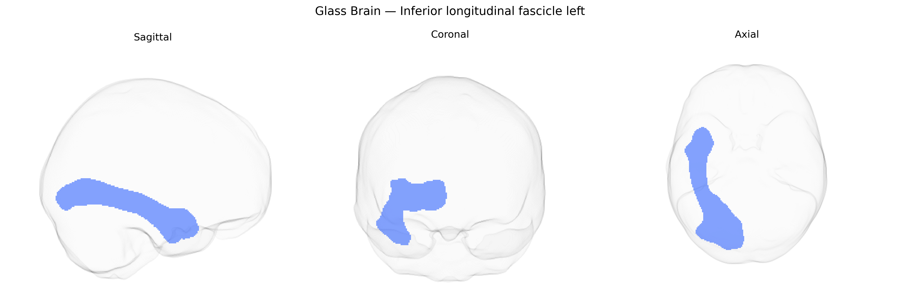

# Inferior longitudinal fascicle left

## Overview

The Inferior longitudinal fascicle left is a long association white matter tract in the left cerebral hemisphere that connects occipital visual regions with anterior temporal cortices, running ventrally along the lateral wall of the ventricle and deep to the fusiform and inferior temporal gyri. It plays a critical role in the integration of visual information with higher-order cognitive and semantic processing, including object recognition, face processing, and aspects of reading and language-related visual functions. The tract’s left-lateralized involvement is often emphasized in models of visual word form processing and semantic networks, and alterations in its microstructure have been associated with neurodevelopmental and neurodegenerative disorders affecting visual recognition and language. There is no direct link for this specific tract; see the related structure [Inferior longitudinal fasciculus](https://en.wikipedia.org/wiki/Inferior_longitudinal_fasciculus).

Very limited tract-specific genetic information is available for the left inferior longitudinal fascicle (ILF) as defined in the Pandora-TractSeg Atlas, and most GWAS work has focused on broader temporal or occipito‑temporal white matter pathways rather than this tract in isolation. Large diffusion MRI GWAS consortia (e.g., ENIGMA, UK Biobank–based studies) have identified numerous loci influencing diffusion metrics such as fractional anisotropy and mean diffusivity in temporal and occipital association tracts, often implicating genes involved in axon guidance, myelination, and neuronal development (for example, variants near or in genes such as CRHR1, CNTNAP2, NTRK3, and others affecting white matter microstructure), but these findings are typically reported at the level of composite regions or major bundles (e.g., inferior fronto‑occipital fasciculus, uncinate, or temporal lobe white matter) rather than a precisely segmented left ILF. Some genetic studies link alterations in ILF microstructure more broadly to neurodevelopmental and psychiatric conditions (including autism spectrum disorder, schizophrenia, and reading or language disorders), but these are usually imaging or case–control associations without clear, replicated SNP– or gene‑level specificity for the left ILF. Overall, while there is strong evidence that genetic factors shape temporal–occipital white matter organization and that ILF integrity is altered in several brain disorders, detailed GWAS results that can be confidently assigned specifically to the left inferior longitudinal fascicle in the Pandora‑TractSeg framework are currently sparse or not yet reported.

*Overview generated by GPT-4o (2026).*

---

**Region ID:** 25  
**Hemisphere:** left  
**Atlas:** Pandora-TractSeg 

---

## Inferior longitudinal fascicle left – Black Background (Full Brain)

**Full Quality Version:** <a href="full_black.mp4" download>Download MP4</a>

---

## Inferior longitudinal fascicle left – White Background (Full Brain)

**Full Quality Version:** <a href="full_white.mp4" download>Download MP4</a>

---

## Triplanar View – T1 Background

---

## Triplanar View – Ghost Brain


