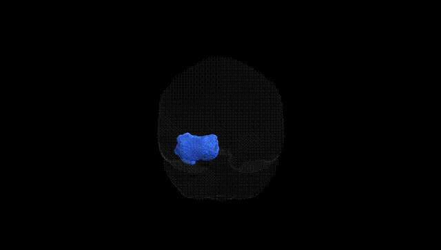
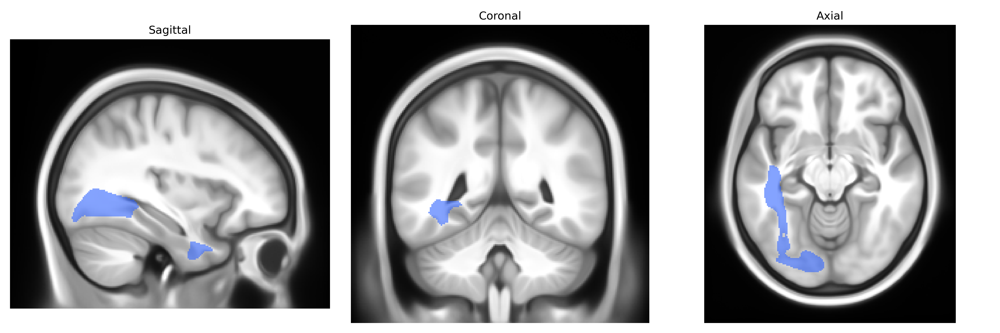

# Inferior longitudinal fascicle left

## Overview

The left inferior longitudinal fascicle (ILF) is a long associative white-matter tract in the left hemisphere that primarily connects occipital visual regions with anterior and medial temporal lobe structures, including portions of the fusiform gyrus, parahippocampal cortex, and temporal pole. It courses ventrally along the lateral ventricle, forming part of the ventral visual processing stream implicated in object and face recognition, visual memory, and aspects of language and semantic processing. In tractography-based atlases such as the Pandora-TractSeg Atlas, the left ILF is delineated as a coherent bundle running anteroposteriorly beneath the inferior temporal cortex, and its microstructural properties (e.g., fractional anisotropy) are frequently investigated in studies of developmental, psychiatric, and neurodegenerative disorders. There is no direct Wikipedia page for the left inferior longitudinal fascicle as a specific atlas entry; a closely related and encompassing structure is described at: https://en.wikipedia.org/wiki/Inferior_longitudinal_fasciculus

*Overview generated by GPT-4o (2026).*

---

**Region ID:** 25  
**Hemisphere:** left  
**Atlas:** Pandora-TractSeg 

---

## Inferior longitudinal fascicle left – Black Background (Full Brain)

**Full Quality Version:** [Download MP4](full_black.mp4)

---

## Inferior longitudinal fascicle left – White Background (Full Brain)

**Full Quality Version:** [Download MP4](full_white.mp4)

---

## Inferior longitudinal fascicle left – Black Background (Hemisphere)

**Full Quality Version:** [Download MP4](hemi_black.mp4)

---

## Inferior longitudinal fascicle left – White Background (Hemisphere)

**Full Quality Version:** [Download MP4](hemi_white.mp4)

---

## Triplanar View – T1 Background

---

## Triplanar View – Ghost Brain


