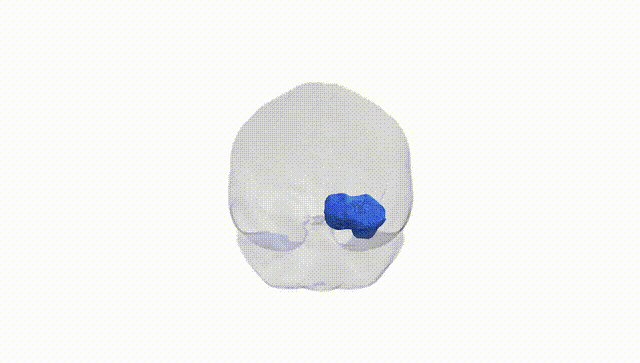
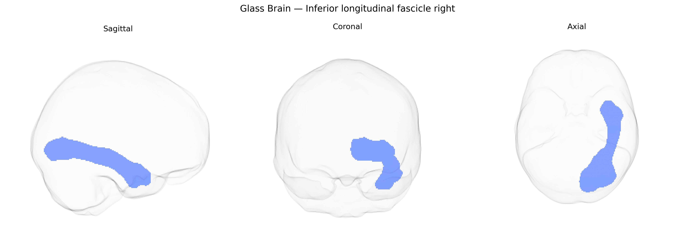

# Inferior longitudinal fascicle right

## Overview

The Inferior longitudinal fascicle right is a major association white matter tract in the right hemisphere that extends longitudinally along the ventral temporal lobe, connecting occipital visual regions with anterior and medial temporal areas involved in object recognition, semantic processing, and aspects of visual memory. Running lateral to the inferior horn of the lateral ventricle and medial to the fusiform and inferior temporal gyri, it forms part of the ventral visual “what” pathway, supporting integration of high-level visual information with stored representations. Anatomically, it is composed of densely packed myelinated fibers that course anteroposteriorly beneath the temporal neocortex, and it maintains close spatial relationships with the inferior fronto-occipital fasciculus and optic radiations. There is no direct link; a closely related structure is the [Inferior longitudinal fasciculus](https://en.wikipedia.org/wiki/Inferior_longitudinal_fasciculus).

As of current literature, there are no well-established, tract-specific genetic associations reported explicitly for the right inferior longitudinal fascicle (ILF) as defined in the Pandora‑TractSeg Atlas; most genetic findings involving this pathway come from broader diffusion MRI GWAS of white matter microstructure that aggregate measures across hemispheres or across multiple tracts. Large-scale studies (e.g., UK Biobank–based GWAS) have identified numerous loci associated with diffusion measures such as fractional anisotropy and mean diffusivity in temporal and occipito‑temporal tracts, often implicating genes involved in axon guidance, myelination, and neurodevelopment (for example, variants near genes such as CNTN4/CNTN6, NRG1/ERBB family members, and oligodendrocyte-related genes), but these are typically reported at the level of ILF combined across both hemispheres or grouped among several association and projection tracts. More specific links between ILF diffusion properties and genetic risk have been suggested indirectly through imaging‑genetics or polygenic risk score studies of neurodevelopmental and psychiatric disorders—such as autism spectrum disorder, schizophrenia, and dyslexia—where altered ILF integrity is observed alongside known polygenic architectures, yet the causal chain from risk variants to ILF‑specific microstructural change remains unclear. Overall, genetic contributions to right ILF variation are likely substantial (given high heritability of white matter metrics in general), but precise, tract‑ and side‑specific GWAS associations for the right ILF in the Pandora‑TractSeg framework remain poorly characterized and should be considered largely unknown at present.

*Overview generated by GPT-4o (2026).*

---

**Region ID:** 26  
**Hemisphere:** right  
**Atlas:** Pandora-TractSeg 

---

## Inferior longitudinal fascicle right – Black Background (Full Brain)

**Full Quality Version:** <a href="full_black.mp4" download>Download MP4</a>

---

## Inferior longitudinal fascicle right – White Background (Full Brain)

**Full Quality Version:** <a href="full_white.mp4" download>Download MP4</a>

---

## Triplanar View – T1 Background

---

## Triplanar View – Ghost Brain


