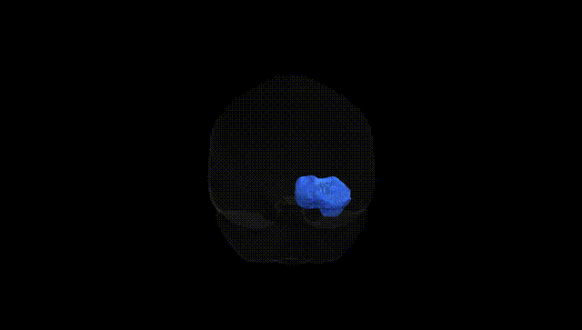
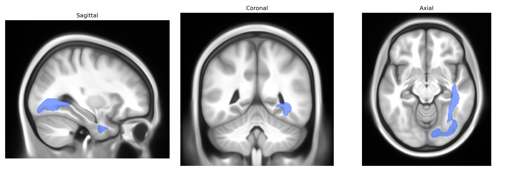

# Inferior longitudinal fascicle right

## Overview

The right inferior longitudinal fascicle (ILF) is a major association white matter tract in the right cerebral hemisphere that extends in an anteroposterior direction along the ventral temporal lobe, connecting occipital visual regions with anterior temporal and limbic-related areas. It courses lateral to the ventricular system and medial to the inferior temporal gyrus, linking regions involved in high-level visual processing, object and face recognition, and aspects of semantic and emotional integration. Functionally, the right ILF is implicated in visual perception, visuospatial processing, and the integration of visual input with memory and affective valuation, and lesions or microstructural alterations in this tract have been associated with deficits in visual recognition and certain neuropsychiatric conditions. There is no direct Wikipedia page specifically for the right inferior longitudinal fascicle; a related and encompassing article is: https://en.wikipedia.org/wiki/Inferior_longitudinal_fasciculus

*Overview generated by GPT-4o (2026).*

---

**Region ID:** 26  
**Hemisphere:** right  
**Atlas:** Pandora-TractSeg 

---

## Inferior longitudinal fascicle right – Black Background (Full Brain)

**Full Quality Version:** [Download MP4](full_black.mp4)

---

## Inferior longitudinal fascicle right – White Background (Full Brain)

**Full Quality Version:** [Download MP4](full_white.mp4)

---

## Inferior longitudinal fascicle right – Black Background (Hemisphere)

**Full Quality Version:** [Download MP4](hemi_black.mp4)

---

## Inferior longitudinal fascicle right – White Background (Hemisphere)

**Full Quality Version:** [Download MP4](hemi_white.mp4)

---

## Triplanar View – T1 Background

---

## Triplanar View – Ghost Brain


