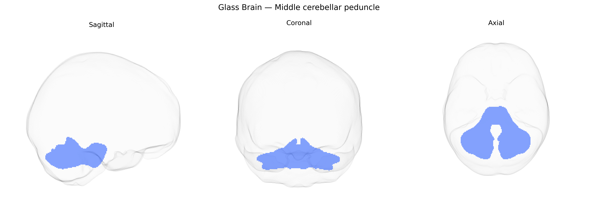

# Middle cerebellar peduncle

## Overview

The middle cerebellar peduncle is a large white matter tract that connects the basilar part of the pons to the cerebellar hemispheres, forming the principal conduit for corticopontocerebellar fibers. Originating from pontine nuclei that receive input from widespread regions of the cerebral cortex, its transverse fibers decussate and enter the contralateral cerebellum, primarily targeting the cerebellar cortex of the posterior lobe. Functionally, it plays a critical role in the coordination and timing of voluntary movements by conveying highly processed cortical information to cerebellar circuits involved in motor planning and sensorimotor integration. Lesions of the middle cerebellar peduncle can result in ataxia, dysmetria, and other cerebellar signs due to disruption of this major input pathway. [Middle cerebellar peduncle](https://en.wikipedia.org/wiki/Middle_cerebellar_peduncle)

Current genetic knowledge specifically targeting the Middle Cerebellar Peduncle (MCP) as defined in the Pandora-TractSeg atlas is limited; most evidence comes from broader diffusion MRI GWAS of cerebellar and brainstem white matter microstructure rather than tract-specific studies. Large-scale imaging-genetics consortia (e.g., UK Biobank–based GWAS of fractional anisotropy and mean diffusivity) have shown that cerebellar and brainstem tracts, including regions overlapping the MCP, exhibit significant SNP-based heritability and polygenic influences, with associations reported near genes involved in axonal guidance, myelination, and neurodevelopment (such as loci near CRHR1, NRG1, and genes in oligodendrocyte/neurite pathways), but these findings are usually aggregated across “cerebellar peduncle” or “brainstem” ROIs rather than the MCP alone. Some psychiatric and neurological GWAS that incorporate diffusion metrics as intermediate phenotypes have linked altered cerebellar white matter integrity more generally to schizophrenia, major depression, bipolar disorder, and neurodegenerative conditions, but again without consistent, replicated, MCP-specific signals. To date, no robust, widely replicated genetic associations are known that uniquely implicate the MCP from Pandora-TractSeg in relation to particular variants, genes, or disorders beyond these broader cerebellar white matter trends, so current evidence for MCP-specific genetic architecture should be regarded as sparse and indirect.

*Overview generated by GPT-4o (2026).*

---

**Region ID:** 27  
**Hemisphere:** bilateral  
**Atlas:** Pandora-TractSeg 

---

## Middle cerebellar peduncle – Black Background (Full Brain)

**Full Quality Version:** <a href="full_black.mp4" download>Download MP4</a>

---

## Middle cerebellar peduncle – White Background (Full Brain)

**Full Quality Version:** <a href="full_white.mp4" download>Download MP4</a>

---

## Triplanar View – T1 Background

---

## Triplanar View – Ghost Brain


