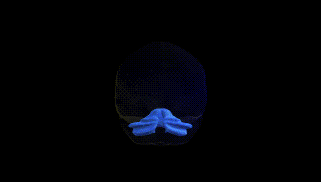
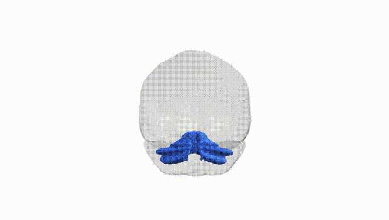
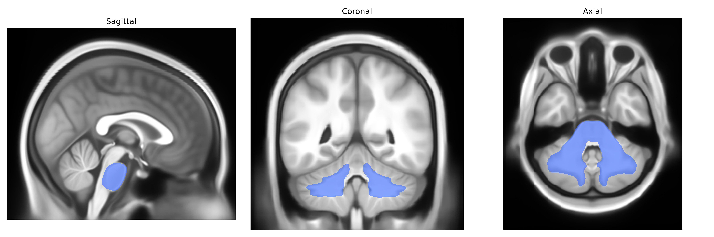

# Middle cerebellar peduncle

## Overview

The bilateral middle cerebellar peduncles are paired, massive white matter fiber bundles that connect the basilar pons to the cerebellar hemispheres, forming the largest of the cerebellar peduncles. They are composed predominantly of pontocerebellar fibers arising from the contralateral pontine nuclei, which relay cortical input from widespread neocortical areas (especially frontoparietal regions) to the cerebellar cortex, thereby integrating motor planning, coordination, and aspects of cognitive processing. These fibers enter the cerebellum laterally, curving around the brainstem, and terminate mainly in the cerebellar hemispheres (particularly the lateral zones), where they contribute to circuits involved in the timing and precision of voluntary movements as well as higher-order functions such as motor learning. Lesions of the middle cerebellar peduncles can produce cerebellar ataxia, dysmetria, dysarthria, and gait disturbance, and they may be involved in demyelinating, degenerative, or vascular pathologies. There is no direct Wikipedia page for the Pandora-TractSeg “bilateral Middle cerebellar peduncle” tract; a closely related structure with detailed information is the “Middle cerebellar peduncle”: https://en.wikipedia.org/wiki/Middle_cerebellar_peduncle

*Overview generated by GPT-4o (2026).*

---

**Region ID:** 27  
**Hemisphere:** bilateral  
**Atlas:** Pandora-TractSeg 

---

## Middle cerebellar peduncle – Black Background (Full Brain)

**Full Quality Version:** [Download MP4](full_black.mp4)

---

## Middle cerebellar peduncle – White Background (Full Brain)

**Full Quality Version:** [Download MP4](full_white.mp4)

---

## Triplanar View – T1 Background

---

## Triplanar View – Ghost Brain


