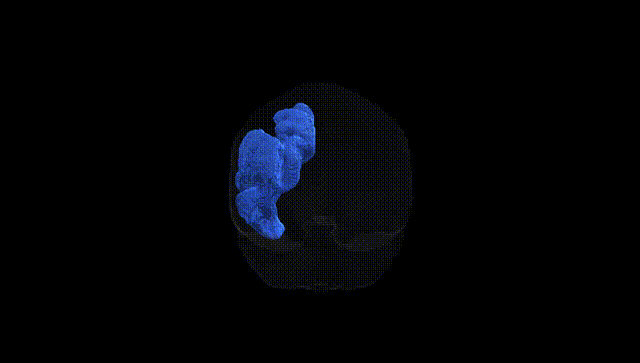
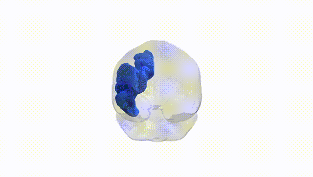

# Middle longitudinal fascicle left

## Overview

The Middle longitudinal fascicle left is a long association white matter tract that runs within the left hemisphere, connecting the superior temporal gyrus and adjacent posterior temporal cortex with parietal and possibly frontal regions, including parts of the inferior parietal lobule. It courses roughly parallel to the arcuate fasciculus but is positioned more medially, contributing to a network involved in auditory processing, language, and higher-order multimodal integration. The tract’s fibers traverse the deep white matter lateral to the ventricle, linking temporal regions involved in phonological and semantic processing with parietal association areas implicated in attention and language comprehension. There is no direct link for the Middle longitudinal fascicle; a closely related structure and region is the [Superior longitudinal fasciculus](https://en.wikipedia.org/wiki/Superior_longitudinal_fasciculus).

Current literature provides very limited tract-specific genetic information for the left middle longitudinal fascicle (MLF) as defined in the Pandora‑TractSeg Atlas; most diffusion MRI GWAS aggregate association signals across broader frontotemporal or parietotemporal white matter regions rather than this tract in isolation. Large-scale neuroimaging genetics studies (e.g., UK Biobank–based GWAS of fractional anisotropy, mean diffusivity, and related measures) have identified dozens to hundreds of loci influencing white matter microstructure, often implicating genes related to axonal growth, myelination, and oligodendrocyte function (such as genes near CNTN4, MAG, or NRXN1 in associative tracts), but these results are typically reported for composite tracts or atlas-defined bundles (e.g., superior longitudinal fasciculus, inferior fronto‑occipital fasciculus) that spatially neighbor or partially overlap the MLF rather than for the MLF itself. Some genetic associations with language, reading, and neurodevelopmental or psychiatric disorders (including schizophrenia and autism spectrum disorder) have been linked to microstructural alterations in temporoparietal association pathways on diffusion MRI, where the MLF is anatomically located, but the evidence is indirect and not resolved to this specific fascicle at the genetic level. As of the latest studies, no robust, replicated GWAS or disorder-specific genetic association has been reported that uniquely targets diffusion metrics of the left MLF from the Pandora‑TractSeg Atlas, so conclusions about its genetic architecture remain largely inferential from neighboring and partially overlapping associative tracts.

*Overview generated by GPT-4o (2026).*

---

**Region ID:** 28  
**Hemisphere:** left  
**Atlas:** Pandora-TractSeg 

---

## Middle longitudinal fascicle left – Black Background (Full Brain)

**Full Quality Version:** <a href="full_black.mp4" download>Download MP4</a>

---

## Middle longitudinal fascicle left – White Background (Full Brain)

**Full Quality Version:** <a href="full_white.mp4" download>Download MP4</a>

---

## Triplanar View – T1 Background

---

## Triplanar View – Ghost Brain


