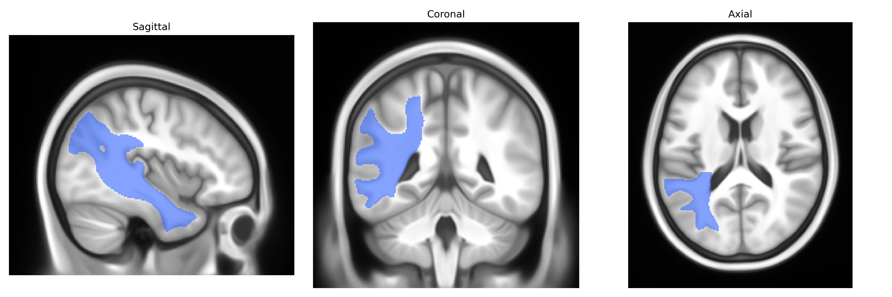
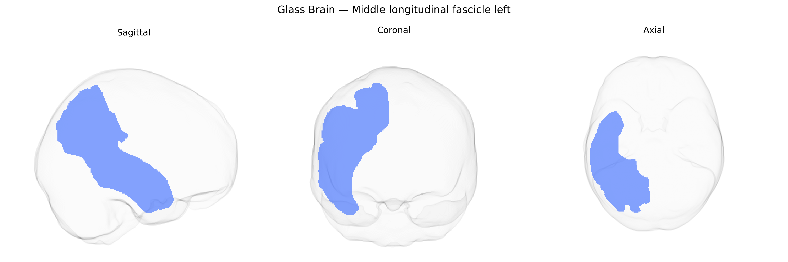

# Middle longitudinal fascicle left

## Overview

The left middle longitudinal fascicle (MLF) is a long association white-matter pathway in the left hemisphere that runs rostrocaudally within the temporal and parietal lobes, interconnecting lateral temporal regions (including portions of the superior and middle temporal gyri) with inferior parietal and posterior frontal areas. In diffusion MRI–based atlases such as the Pandora-TractSeg Atlas, it is delineated as part of the ventral language- and auditory-related association system, and is thought to contribute to higher-order language processing, semantic integration, and multimodal sensory association by facilitating information transfer between temporal auditory/semantic regions and parietal-frontal integration hubs. There is no direct Wikipedia article specifically on the “middle longitudinal fascicle”; a closely related and spatially adjacent system is the superior longitudinal fasciculus: https://en.wikipedia.org/wiki/Superior_longitudinal_fasciculus

*Overview generated by GPT-4o (2026).*

---

**Region ID:** 28  
**Hemisphere:** left  
**Atlas:** Pandora-TractSeg 

---

## Middle longitudinal fascicle left – Black Background (Full Brain)

**Full Quality Version:** [Download MP4](full_black.mp4)

---

## Middle longitudinal fascicle left – White Background (Full Brain)

**Full Quality Version:** [Download MP4](full_white.mp4)

---

## Middle longitudinal fascicle left – Black Background (Hemisphere)

**Full Quality Version:** [Download MP4](hemi_black.mp4)

---

## Middle longitudinal fascicle left – White Background (Hemisphere)

**Full Quality Version:** [Download MP4](hemi_white.mp4)

---

## Triplanar View – T1 Background

---

## Triplanar View – Ghost Brain


