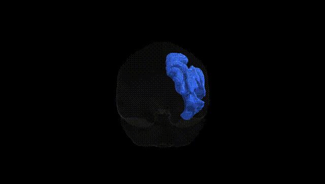
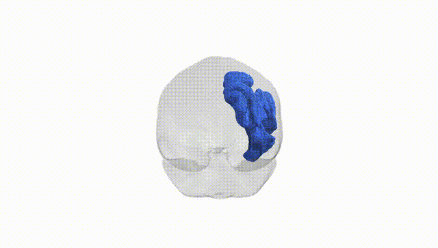
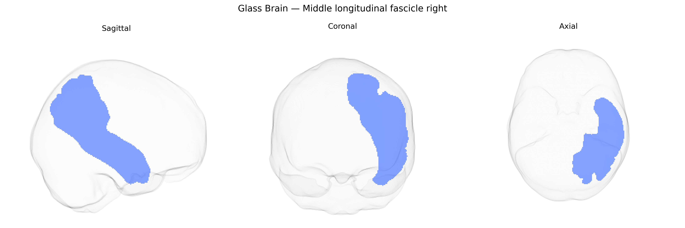

# Middle longitudinal fascicle right

## Overview

The Middle longitudinal fascicle right (MDLF_R) is a long association white matter tract in the right cerebral hemisphere that runs predominantly in the dorsolateral temporal and parietal white matter, interconnecting the superior temporal gyrus and adjacent temporal regions with the inferior parietal lobule and posterior parietal cortex. It courses roughly parallel to the superior longitudinal fascicle but is situated more ventrally, contributing to networks involved in auditory processing, language, attention, and higher-order multimodal integration. The MDLF is structurally and functionally linked to fronto-parietal and temporo-parietal association networks and is often studied with diffusion MRI tractography in the context of language lateralization and neurodevelopmental or neuropsychiatric disorders. There is no direct link; a related structure is the [Superior longitudinal fasciculus](https://en.wikipedia.org/wiki/Superior_longitudinal_fasciculus).

Current literature contains very limited tract-specific genetic findings for the right middle longitudinal fasciculus (MLF) as defined in the Pandora‑TractSeg atlas; most large diffusion MRI GWAS either do not report the MLF separately or aggregate it into broader fronto‑temporo‑parietal association fiber categories. Genome‑wide studies of white matter microstructure (e.g., UK Biobank–based GWAS of fractional anisotropy, mean diffusivity, and related metrics) have identified numerous loci and polygenic influences affecting association tracts in temporal and parietal regions—often implicating genes involved in axon guidance (such as ROBO and SLIT family genes), myelination and oligodendrocyte biology (e.g., MAG, MBP, GAL3ST1), and neurodevelopmental signaling pathways—but these effects are typically reported at the level of tract groups (e.g., “superior longitudinal/middle longitudinal fasciculi” or “temporal association fibers”) rather than the right MLF alone. Similarly, imaging‑genetics work in psychiatric and neurodevelopmental disorders (including schizophrenia, autism spectrum disorder, attention‑deficit/hyperactivity disorder, and major depression) has linked polygenic risk scores and candidate loci to altered microstructure in lateral temporo‑parietal association pathways, yet explicit, lateralized right‑MLF genetic associations are rarely distinguished from neighboring tracts such as the superior longitudinal fasciculus and arcuate fasciculus. As a result, current evidence supports a general polygenic influence on temporo‑parietal association white matter that likely encompasses the right MLF, but specific, replicated GWAS hits or disorder‑linked loci uniquely mapped to the right MLF in the Pandora‑TractSeg atlas are not well established and remain largely unresolved in the published literature.

*Overview generated by GPT-4o (2026).*

---

**Region ID:** 29  
**Hemisphere:** right  
**Atlas:** Pandora-TractSeg 

---

## Middle longitudinal fascicle right – Black Background (Full Brain)

**Full Quality Version:** <a href="full_black.mp4" download>Download MP4</a>

---

## Middle longitudinal fascicle right – White Background (Full Brain)

**Full Quality Version:** <a href="full_white.mp4" download>Download MP4</a>

---

## Triplanar View – T1 Background

---

## Triplanar View – Ghost Brain


