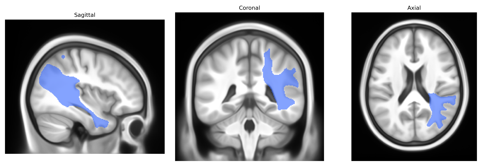

# Middle longitudinal fascicle right

## Overview

The right middle longitudinal fascicle (MLF) is a long association white matter tract in the right hemisphere that course superficially within the superior temporal gyrus and extends anteroposteriorly to connect temporal regions—particularly the superior and middle temporal cortex—with parietal and occipital association areas. It is implicated in higher-order auditory and language-related processing, including integration of auditory, visual, and possibly semantic information across temporal and parietal regions. The tract runs in close spatial relationship to, and partly interdigitates with, neighboring association bundles such as the arcuate fasciculus and the inferior longitudinal fasciculus, and is typically delineated in diffusion MRI–based tractography atlases such as the Pandora-TractSeg Atlas rather than in classical gross neuroanatomical atlases. There is no direct Wikipedia entry for the “middle longitudinal fascicle”; a related structure and cortical territory it interconnects is described here: https://en.wikipedia.org/wiki/Superior_temporal_gyrus

*Overview generated by GPT-4o (2026).*

---

**Region ID:** 29  
**Hemisphere:** right  
**Atlas:** Pandora-TractSeg 

---

## Middle longitudinal fascicle right – Black Background (Full Brain)

**Full Quality Version:** [Download MP4](full_black.mp4)

---

## Middle longitudinal fascicle right – White Background (Full Brain)

**Full Quality Version:** [Download MP4](full_white.mp4)

---

## Middle longitudinal fascicle right – Black Background (Hemisphere)

**Full Quality Version:** [Download MP4](hemi_black.mp4)

---

## Middle longitudinal fascicle right – White Background (Hemisphere)

**Full Quality Version:** [Download MP4](hemi_white.mp4)

---

## Triplanar View – T1 Background

---

## Triplanar View – Ghost Brain


