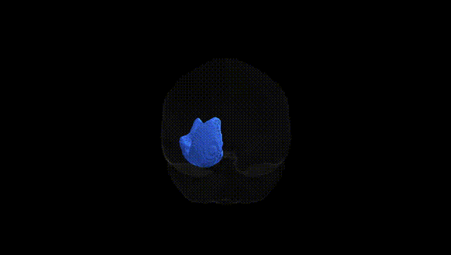
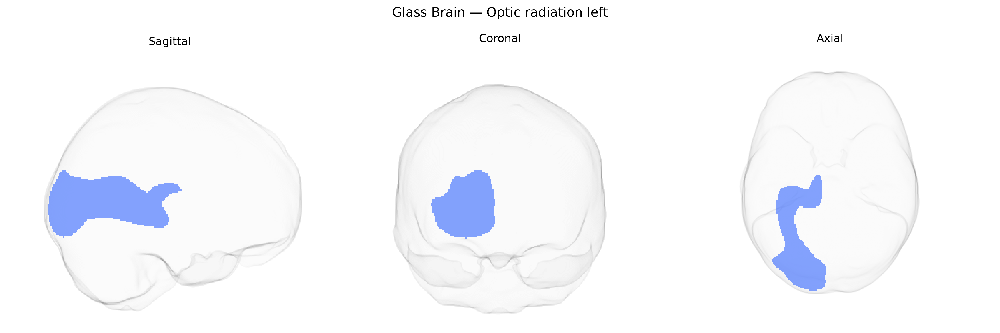

# Optic radiation left

## Overview

The left optic radiation is a major white matter tract that conveys visual information from the lateral geniculate nucleus of the thalamus to the primary visual cortex (V1) in the occipital lobe, following a curved course around the lateral ventricles and deep to the temporal and parietal lobes. It is topographically organized, with fibers subserving the inferior visual field traveling more dorsally and those representing the superior visual field, including Meyer’s loop, arching anteriorly into the temporal lobe before turning posteriorly. This tract is essential for conscious visual perception, and focal lesions can produce characteristic contralateral homonymous visual field defects depending on which bundle is affected. Although there is no dedicated Wikipedia article specifically for the left optic radiation, the structure is described within the broader entry on the [Optic radiation](https://en.wikipedia.org/wiki/Optic_radiation).

As of the latest available literature, there are no published genetic studies specifically targeting the “Optic radiation left” white matter tract as defined in the Pandora‑TractSeg Atlas; instead, evidence comes from broader diffusion MRI and tract-specific GWAS that often analyze optic radiations bilaterally or as part of global visual pathways. Large-scale imaging genetics consortia (e.g., ENIGMA, UK Biobank–based studies) have identified common variants and loci associated with diffusion metrics such as fractional anisotropy (FA) and mean diffusivity (MD) in or near the optic radiations, implicating genes involved in axonal guidance, myelination, and neurodevelopment (for example, loci near genes related to oligodendrocyte function and neuronal growth), but these findings are typically reported at the level of the optic radiations as a whole rather than left-sided tracts alone. Genetic correlations have been reported between optic radiation microstructure and visual acuity, cognitive performance, educational attainment, and risk for neuropsychiatric or neurodevelopmental disorders, including schizophrenia and multiple sclerosis, reflecting the broader genetic architecture of white matter integrity. However, a clear, tract-specific catalogue of variants or genes uniquely linked to the left optic radiation from the Pandora‑TractSeg Atlas has not been established, so current knowledge is largely extrapolated from bilateral or global optic radiation and white matter GWAS findings.

*Overview generated by GPT-4o (2026).*

---

**Region ID:** 30  
**Hemisphere:** left  
**Atlas:** Pandora-TractSeg 

---

## Optic radiation left – Black Background (Full Brain)

**Full Quality Version:** <a href="full_black.mp4" download>Download MP4</a>

---

## Optic radiation left – White Background (Full Brain)

**Full Quality Version:** <a href="full_white.mp4" download>Download MP4</a>

---

## Triplanar View – T1 Background

---

## Triplanar View – Ghost Brain


