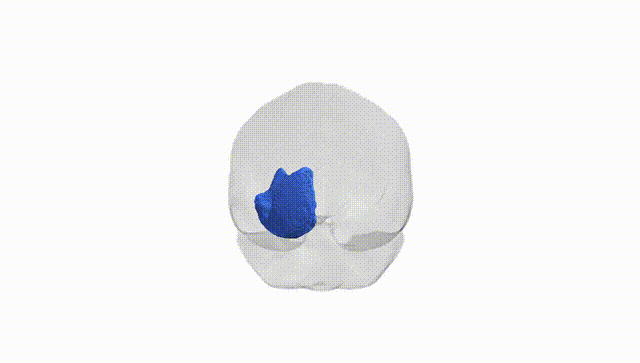
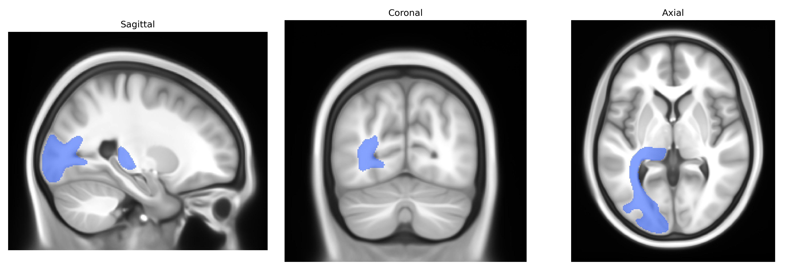

# Optic radiation left

## Overview

The left optic radiation is a major white matter tract in the left cerebral hemisphere that conveys visual information from the lateral geniculate nucleus of the thalamus to the primary visual cortex (V1, Brodmann area 17) in the occipital lobe. Composed of tightly bundled myelinated axons, it maintains a retinotopic organization, with different fiber subcomponents (including Meyer’s loop anteriorly in the temporal lobe) carrying information from specific regions of the contralateral visual field. The tract arches laterally and posteriorly around the temporal horn of the lateral ventricle and through the parietal and temporal lobes, integrating into the calcarine cortex where conscious visual perception is initiated. Lesions confined to the left optic radiation produce characteristic contralateral (right) visual field deficits such as homonymous quadrantanopia or hemianopia, depending on which segment of the radiation is affected, and thus play a key role in clinical neuro-ophthalmology and neurosurgical planning.  

Wikipedia link (no separate page for “left” optic radiation; general structure is shared bilaterally):  
https://en.wikipedia.org/wiki/Optic_radiation

*Overview generated by GPT-4o (2026).*

---

**Region ID:** 30  
**Hemisphere:** left  
**Atlas:** Pandora-TractSeg 

---

## Optic radiation left – Black Background (Full Brain)

**Full Quality Version:** [Download MP4](full_black.mp4)

---

## Optic radiation left – White Background (Full Brain)

**Full Quality Version:** [Download MP4](full_white.mp4)

---

## Optic radiation left – Black Background (Hemisphere)

**Full Quality Version:** [Download MP4](hemi_black.mp4)

---

## Optic radiation left – White Background (Hemisphere)

**Full Quality Version:** [Download MP4](hemi_white.mp4)

---

## Triplanar View – T1 Background

---

## Triplanar View – Ghost Brain


