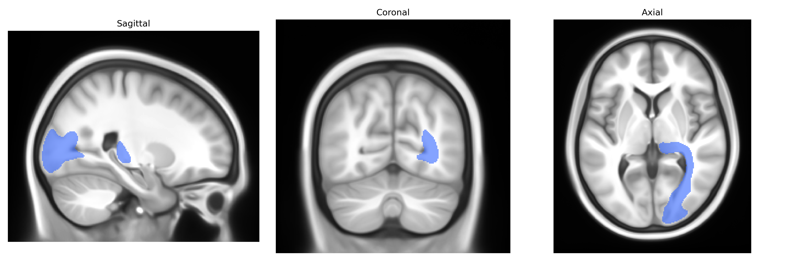

# Optic radiation right

## Overview

The right optic radiation is a major white matter tract of the visual pathway that conveys visual information from the lateral geniculate nucleus (LGN) of the thalamus to the primary visual cortex in the occipital lobe. It consists of heavily myelinated axons that fan out laterally and posteriorly from the LGN, passing deep to the temporal and parietal lobes; its anterior fibers form Meyer’s loop, which arc into the temporal lobe before turning back toward the occipital cortex, while more dorsal fibers course through the parietal lobe. Functionally, the right optic radiation carries information primarily from the left visual hemifield of both eyes, and lesions within it can cause characteristic contralateral homonymous visual field defects, such as quadrantanopia or hemianopia, depending on which fiber bundles are affected. There is no direct Wikipedia article on the right optic radiation; see the related structure [Optic radiation](https://en.wikipedia.org/wiki/Optic_radiation).

Current genetic knowledge specific to the right optic radiation white matter tract as defined in the Pandora-TractSeg Atlas is limited; most findings come from large-scale diffusion MRI GWAS that analyze tract-averaged metrics across many bundles rather than this tract in isolation. In general, diffusion measures of the optic radiations (often bilaterally) show SNP-based heritability and have been associated with loci involved in axon guidance, myelination, and neurodevelopmental pathways, with reported signals near genes such as PAX6, ROBO/SLIT family members, and myelin-related genes in some multi-tract studies, though these are not consistently optic-radiation-specific. Tract-based heritability studies indicate that fractional anisotropy (FA) and mean diffusivity (MD) in visual and posterior white matter tracts, including the optic radiations, are moderately heritable and share polygenic architecture with traits like general cognitive ability, educational attainment, and intracranial volume, but these results are typically reported at the level of global or regional white matter networks. Some neurodevelopmental and neuropsychiatric disorders (e.g., schizophrenia, multiple sclerosis, and albinism) show disease-related alterations in optic radiation microstructure, and the genetic risk loci for these disorders may indirectly affect this tract’s integrity, yet direct tract-specific GWAS linking particular variants to right optic radiation FA or MD from the Pandora-TractSeg Atlas have not been clearly delineated in the literature to date. Overall, evidence supports a polygenic and developmentally regulated basis for individual differences in optic radiation microstructure, but precise variant–tract associations for the right optic radiation in this specific atlas framework remain sparsely characterized.

*Overview generated by GPT-4o (2026).*

---

**Region ID:** 31  
**Hemisphere:** right  
**Atlas:** Pandora-TractSeg 

---

## Optic radiation right – Black Background (Full Brain)

**Full Quality Version:** <a href="full_black.mp4" download>Download MP4</a>

---

## Optic radiation right – White Background (Full Brain)

**Full Quality Version:** <a href="full_white.mp4" download>Download MP4</a>

---

## Triplanar View – T1 Background

---

## Triplanar View – Ghost Brain


