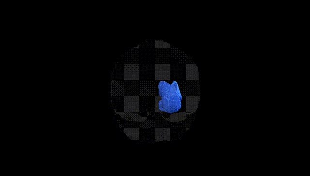
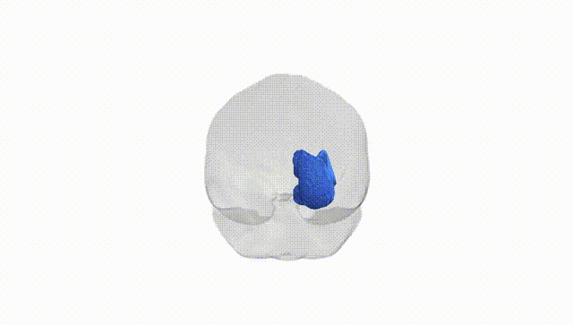
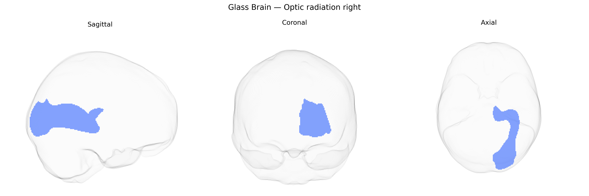

# Optic radiation right

## Overview

The right optic radiation is a major white-matter fiber pathway in the right cerebral hemisphere that conveys visual information from the lateral geniculate nucleus (LGN) of the thalamus to the primary visual cortex (V1, Brodmann area 17) in the occipital lobe. It is topographically organized, with distinct fiber bundles representing different portions of the visual field, including a ventral component (often termed Meyer’s loop) that sweeps anteriorly into the temporal lobe before coursing posteriorly, and a more dorsal component passing through the parietal lobe. Functionally, the right optic radiation transmits retinotopically ordered signals from both eyes corresponding primarily to the left visual hemifield, playing a critical role in conscious visual perception; lesions in this tract can cause characteristic contralateral homonymous visual field defects.  

Wikipedia link: There is no direct page specifically for the “right optic radiation”; a closely related structure is described here: https://en.wikipedia.org/wiki/Optic_radiation

*Overview generated by GPT-4o (2026).*

---

**Region ID:** 31  
**Hemisphere:** right  
**Atlas:** Pandora-TractSeg 

---

## Optic radiation right – Black Background (Full Brain)

**Full Quality Version:** [Download MP4](full_black.mp4)

---

## Optic radiation right – White Background (Full Brain)

**Full Quality Version:** [Download MP4](full_white.mp4)

---

## Optic radiation right – Black Background (Hemisphere)

**Full Quality Version:** [Download MP4](hemi_black.mp4)

---

## Optic radiation right – White Background (Hemisphere)

**Full Quality Version:** [Download MP4](hemi_white.mp4)

---

## Triplanar View – T1 Background

---

## Triplanar View – Ghost Brain


