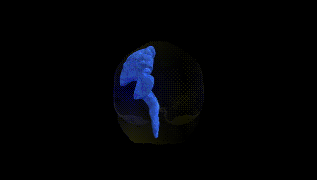
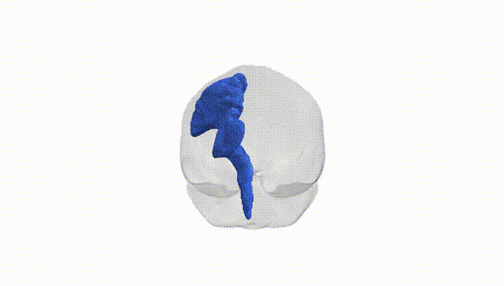
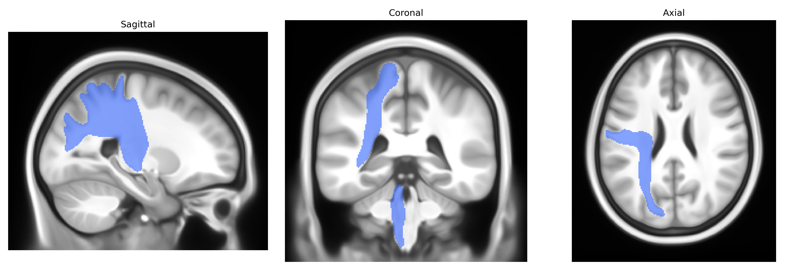
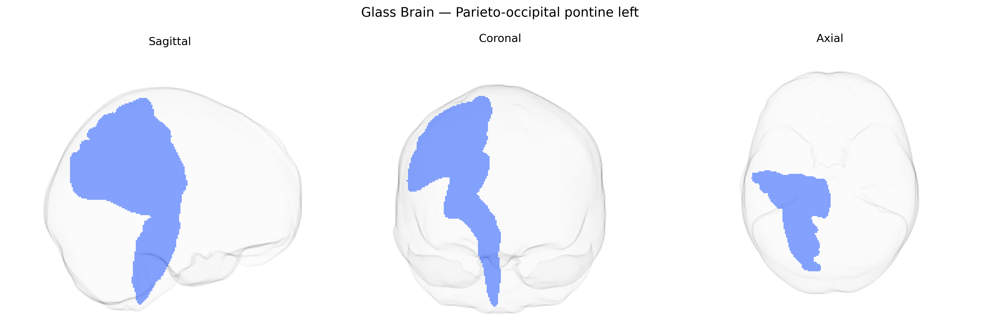

# Parieto-occipital pontine left

## Overview

The parieto-occipital pontine left white matter tract, as defined in the Pandora-TractSeg Atlas, is a long association and projection fiber pathway that links cortical regions of the parietal and occipital lobes with pontine nuclei in the brainstem. It carries corticopontine fibers that originate from higher-order sensory and visuospatial processing areas in the posterior cortex and descend through the internal capsule and cerebral peduncle to terminate in the pons, where they synapse onto pontine neurons that project to the cerebellum via pontocerebellar fibers. This tract contributes to the integration of visual, spatial, and sensorimotor information with cerebellar circuits involved in coordination, motor planning, and adaptation of visually guided movements. There is no direct link for this specific tract; a related structure and pathway is the [Corticopontine fibers](https://en.wikipedia.org/wiki/Corticopontine_fibers).

As of current literature, there are no robust, tract-specific genetic association studies published for the Parieto-occipital pontine left white matter tract as defined in the Pandora-TractSeg Atlas, and no GWAS has directly targeted this individually labeled pathway. Most diffusion MRI GWAS on fractional anisotropy, mean diffusivity, or related metrics focus on broader regions (e.g., global white matter, major association tracts like the corticospinal tract, superior longitudinal fasciculus, or optic radiation) or use atlas-agnostic voxelwise approaches, making it difficult to ascribe findings specifically to this parieto-occipital pontine tract. Large consortia such as ENIGMA and UK Biobank have identified polygenic influences on posterior white matter microstructure and on occipital or parietal association pathways, with implicated loci often involving myelination, axonal development, and neuroinflammatory genes, and these have been linked to traits such as cognitive performance, neuropsychiatric risk (e.g., schizophrenia, depression), and neurodegeneration; however, these associations are not resolved to this particular tract. Consequently, existing evidence for genetic influences on this tract is indirect, inferred from general genetic effects on posterior white matter organization rather than from any tract-specific GWAS or disorder-focused genetic study.

*Overview generated by GPT-4o (2026).*

---

**Region ID:** 32  
**Hemisphere:** left  
**Atlas:** Pandora-TractSeg 

---

## Parieto-occipital pontine left – Black Background (Full Brain)

**Full Quality Version:** <a href="full_black.mp4" download>Download MP4</a>

---

## Parieto-occipital pontine left – White Background (Full Brain)

**Full Quality Version:** <a href="full_white.mp4" download>Download MP4</a>

---

## Triplanar View – T1 Background

---

## Triplanar View – Ghost Brain


