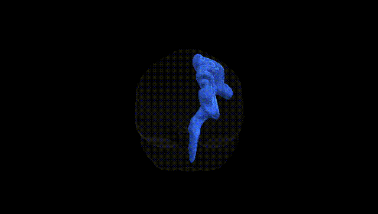
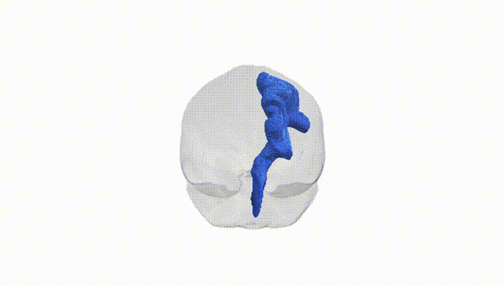
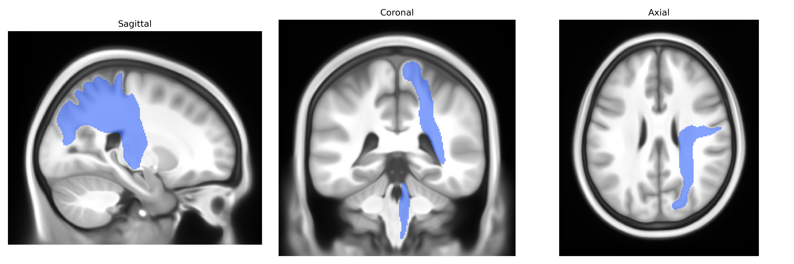
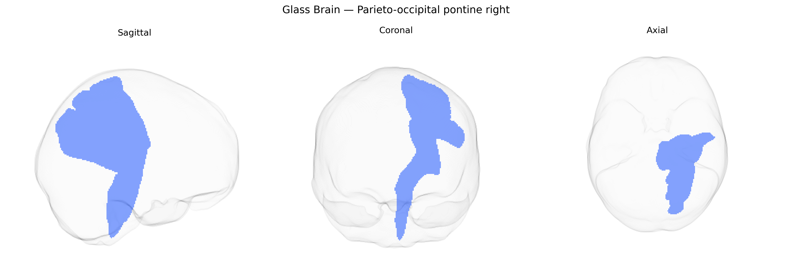

# Parieto-occipital pontine right

## Overview

The parieto-occipital pontine right white matter tract, as defined in the Pandora-TractSeg Atlas, is a right-hemispheric cortico-pontine projection pathway that links associative visual and visuospatial regions of the parietal and occipital lobes with pontine nuclei in the brainstem. Originating primarily from cortical areas involved in visuospatial integration, visual processing, and higher-order sensory association, its fibers descend through the deep white matter, converge into the posterior limb of the internal capsule and cerebral peduncles, and terminate in pontine relay nuclei that project onward to the cerebellum via pontocerebellar fibers. Functionally, this tract is thought to contribute to visuomotor coordination, oculomotor control, and the integration of visual-perceptual information into motor planning and cerebellar modulation. There is no direct link; a related structure is the [Corticopontine fiber](https://en.wikipedia.org/wiki/Corticopontine_fiber).

As of current literature, there are no tract-specific genetic association studies focused explicitly on the Parieto-occipital pontine right white matter tract as defined in the Pandora-TractSeg Atlas, and no GWAS has reported loci uniquely tied to this precisely delineated pathway. Most available genetic findings involving diffusion MRI measures such as fractional anisotropy (FA) and mean diffusivity (MD) have been conducted either at the level of broader white matter regions (e.g., posterior thalamic radiation, inferior fronto-occipital fasciculus, optic radiation) or global summary measures, rather than this specific parieto-occipital–pontine tract. Large-scale imaging genetics consortia (e.g., ENIGMA, UK Biobank analyses) have identified multiple loci associated with posterior and occipital white matter microstructure, and polygenic architectures linking white matter integrity to traits and disorders such as cognitive performance, schizophrenia, major depression, and Alzheimer’s disease, but these results are not mapped at the granularity of the Pandora-TractSeg parieto-occipital pontine tract. Consequently, any inference about genetic associations with this tract is indirect, extrapolated from nearby or overlapping posterior white matter systems, and there is currently no direct GWAS evidence or disorder-specific genetic linkage uniquely assigned to this right parieto-occipital pontine tract.

*Overview generated by GPT-4o (2026).*

---

**Region ID:** 33  
**Hemisphere:** right  
**Atlas:** Pandora-TractSeg 

---

## Parieto-occipital pontine right – Black Background (Full Brain)

**Full Quality Version:** <a href="full_black.mp4" download>Download MP4</a>

---

## Parieto-occipital pontine right – White Background (Full Brain)

**Full Quality Version:** <a href="full_white.mp4" download>Download MP4</a>

---

## Triplanar View – T1 Background

---

## Triplanar View – Ghost Brain


