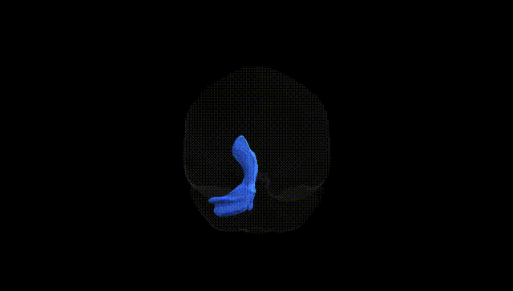
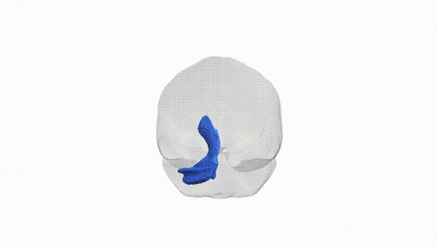
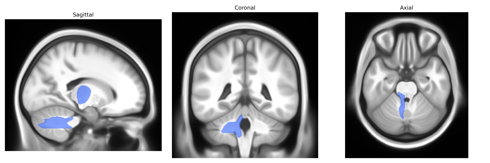
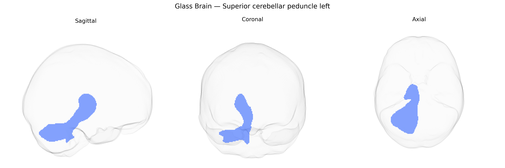

# Superior cerebellar peduncle left

## Overview

The left superior cerebellar peduncle is a major efferent white matter pathway connecting the cerebellum to the midbrain and, via decussation, to contralateral thalamic and cortical motor areas. Arising primarily from dentate, interposed, and fastigial cerebellar nuclei, its fibers course rostrally and dorsomedially, decussating in the midbrain to form the principal output route for cerebellar modulation of voluntary movement, motor learning, coordination, and aspects of cognitive processing. This tract carries cerebellothalamic and cerebellorubral projections that influence motor planning and execution in frontal and motor cortices, thereby integrating sensory feedback with motor commands to refine timing, precision, and adaptation of movements; disruption of the superior cerebellar peduncle is associated with ataxia, dysmetria, and other cerebellar motor syndromes.  

Wikipedia link (related structure): https://en.wikipedia.org/wiki/Superior_cerebellar_peduncle

*Overview generated by GPT-4o (2026).*

---

**Region ID:** 34  
**Hemisphere:** left  
**Atlas:** Pandora-TractSeg 

---

## Superior cerebellar peduncle left – Black Background (Full Brain)

**Full Quality Version:** [Download MP4](full_black.mp4)

---

## Superior cerebellar peduncle left – White Background (Full Brain)

**Full Quality Version:** [Download MP4](full_white.mp4)

---

## Superior cerebellar peduncle left – Black Background (Hemisphere)

**Full Quality Version:** [Download MP4](hemi_black.mp4)

---

## Superior cerebellar peduncle left – White Background (Hemisphere)

**Full Quality Version:** [Download MP4](hemi_white.mp4)

---

## Triplanar View – T1 Background

---

## Triplanar View – Ghost Brain


