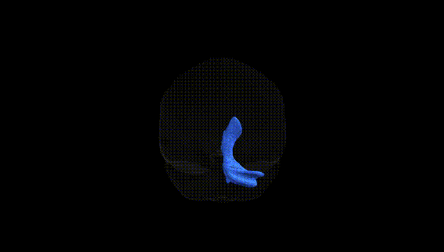
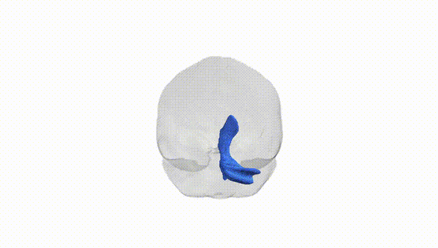

# Superior cerebellar peduncle right

## Overview

The superior cerebellar peduncle right is a major efferent white matter tract connecting the deep cerebellar nuclei, principally the dentate nucleus, of the right cerebellar hemisphere to midbrain and thalamic structures, thereby contributing critically to the cerebello-thalamo-cortical motor pathway. Its fibers decussate in the midbrain at the level of the inferior colliculi, so that the right superior cerebellar peduncle predominantly influences the motor cortex of the contralateral (left) cerebral hemisphere. Functionally, it is involved in the coordination, timing, and precision of voluntary movements, as well as in motor learning and aspects of cognitive processing mediated by cerebellar output to frontal and parietal association cortices. Structural or functional disruption of this tract, such as by demyelination, stroke, or compressive lesions, can result in ataxia, dysmetria, intention tremor, and other cerebellar signs, often with lateralized manifestations corresponding to the side of the affected cerebellum despite contralateral cortical projection. [Superior cerebellar peduncle](https://en.wikipedia.org/wiki/Superior_cerebellar_peduncle)

Current genetic knowledge specific to the Superior cerebellar peduncle right (SCP-R) white matter tract, as defined in the Pandora-TractSeg Atlas, is limited, and few studies target this tract in isolation; most findings come from large diffusion MRI GWAS that treat the SCP (often not lateralized) as part of broader cerebellar or brainstem white matter. Multivariate GWAS of diffusion metrics (e.g., fractional anisotropy, mean and radial diffusivity) across dozens of tracts have shown that cerebellar and brainstem pathways, including the SCP, share polygenic architecture with cognitive performance, educational attainment, and general brain volume, but specific SNP–tract associations for SCP-R are rarely reported. Some imaging-genetics studies implicate variants in genes involved in axon guidance, myelination, and oligodendrocyte function (such as those in the neuregulin–ERBB and cell-adhesion pathways) in microstructural variation of cerebellar and brainstem tracts, with occasional signals overlapping regions associated with neurodevelopmental and psychiatric disorders (e.g., schizophrenia, ADHD, autism), though these are usually not SCP-R–specific and often fall below genome-wide significance when analyzed at the single-tract level. Overall, existing evidence suggests that SCP-R microstructure is influenced by highly polygenic, shared white-matter genetic factors rather than by a well-characterized set of tract-specific loci, and there are no robust, replicated SNP or gene associations that uniquely and specifically define genetic risk or trait variation for the superior cerebellar peduncle right tract as delineated in the Pandora-TractSeg Atlas.

*Overview generated by GPT-4o (2026).*

---

**Region ID:** 35  
**Hemisphere:** right  
**Atlas:** Pandora-TractSeg 

---

## Superior cerebellar peduncle right – Black Background (Full Brain)

**Full Quality Version:** <a href="full_black.mp4" download>Download MP4</a>

---

## Superior cerebellar peduncle right – White Background (Full Brain)

**Full Quality Version:** <a href="full_white.mp4" download>Download MP4</a>

---

## Triplanar View – T1 Background

---

## Triplanar View – Ghost Brain


