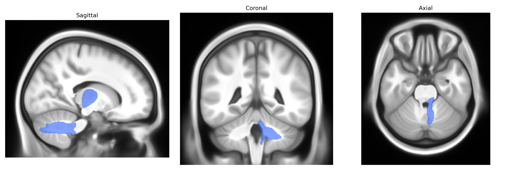
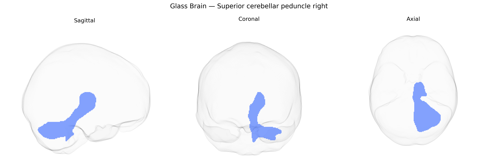

# Superior cerebellar peduncle right

## Overview

The right superior cerebellar peduncle is a major efferent white matter tract of the cerebellum that primarily conveys output from the deep cerebellar nuclei, especially the dentate nucleus, to supratentorial motor and associative regions. Fibers ascend from the right cerebellar hemisphere and vermis, decussate in the midbrain (decussation of the superior cerebellar peduncles), and project mainly to the contralateral red nucleus and thalamic motor nuclei (particularly ventrolateral thalamus), thereby influencing cortical motor planning and execution, coordination of limb movements, and aspects of motor learning and timing. In atlases such as the Pandora-TractSeg Atlas, this tract is delineated as a distinct right-sided cerebellar outflow pathway within the posterior fossa, forming part of the cerebellar peduncular system that integrates cerebellar computation with brainstem and thalamocortical circuits. There is no direct Wikipedia page specifically for the “right superior cerebellar peduncle”; a related structure description is available at: https://en.wikipedia.org/wiki/Superior_cerebellar_peduncle

*Overview generated by GPT-4o (2026).*

---

**Region ID:** 35  
**Hemisphere:** right  
**Atlas:** Pandora-TractSeg 

---

## Superior cerebellar peduncle right – Black Background (Full Brain)

**Full Quality Version:** [Download MP4](full_black.mp4)

---

## Superior cerebellar peduncle right – White Background (Full Brain)

**Full Quality Version:** [Download MP4](full_white.mp4)

---

## Superior cerebellar peduncle right – Black Background (Hemisphere)

**Full Quality Version:** [Download MP4](hemi_black.mp4)

---

## Superior cerebellar peduncle right – White Background (Hemisphere)

**Full Quality Version:** [Download MP4](hemi_white.mp4)

---

## Triplanar View – T1 Background

---

## Triplanar View – Ghost Brain


