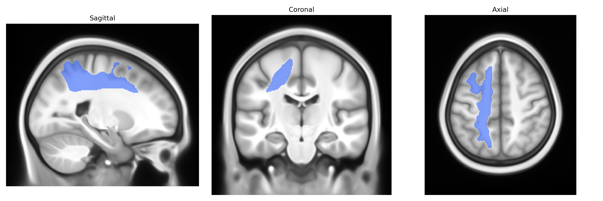
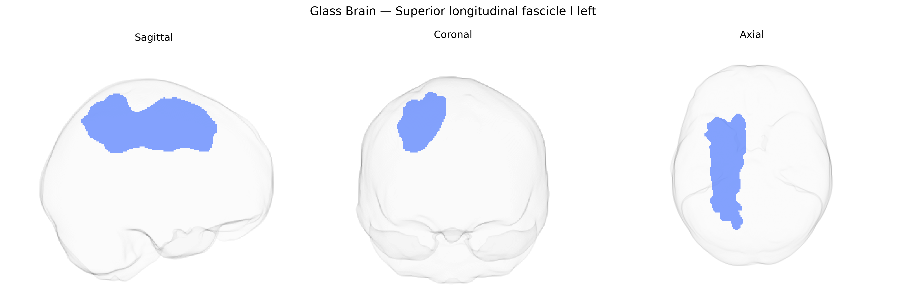

# Superior longitudinal fascicle I left

## Overview

The Superior longitudinal fascicle I left is a major association white matter tract located in the left cerebral hemisphere that connects superior and medial parietal regions with frontal cortical areas, running dorsally above the insula and lateral ventricles. It is considered the most dorsal component of the superior longitudinal fasciculus system and contributes to higher-order functions such as visuospatial integration, attention, and aspects of motor planning by linking parietal sensory integration zones with frontal executive and premotor regions. Anatomically, it courses within the deep white matter of the superior parietal lobule and superior frontal gyrus, exhibiting a generally anteroposterior orientation, and is often distinguished from other SLF branches (II and III) by its more medial and dorsal trajectory and its connections to superior parietal cortex. There is no direct link for this specific subcomponent; see the related structure [Superior longitudinal fasciculus](https://en.wikipedia.org/wiki/Superior_longitudinal_fasciculus).

Current literature provides very limited tract-specific genetic information for the left Superior Longitudinal Fasciculus I (SLF I) as defined in the Pandora-TractSeg atlas, because most diffusion MRI GWAS aggregate measures across broader SLF regions or whole-brain white matter rather than isolating this dorsal subdivision. Large-scale imaging genetics studies (e.g., UK Biobank) have identified numerous loci associated with diffusion metrics such as fractional anisotropy and mean diffusivity in SLF-related regions, often implicating genes involved in axon guidance, myelination, and neurodevelopment (including pathways featuring genes such as NTRK1/2, CNTNAP2, and others), and polygenic overlap has been reported between SLF microstructure and cognitive performance, educational attainment, and psychiatric traits such as schizophrenia and major depression. However, these findings generally refer to combined SLF tracts or atlas definitions that do not map cleanly onto SLF I as segmented by Pandora-TractSeg, and no robust, replicated GWAS has yet provided a clear, specific set of genetic associations uniquely tied to the left SLF I tract; thus, any genetic links to disorders or traits (e.g., language, attention, working memory, or mood and psychotic disorders) remain indirect and inferred from broader SLF or frontoparietal white matter analyses rather than from SLF I–specific studies.

*Overview generated by GPT-4o (2026).*

---

**Region ID:** 40  
**Hemisphere:** left  
**Atlas:** Pandora-TractSeg 

---

## Superior longitudinal fascicle I left – Black Background (Full Brain)

**Full Quality Version:** <a href="full_black.mp4" download>Download MP4</a>

---

## Superior longitudinal fascicle I left – White Background (Full Brain)

**Full Quality Version:** <a href="full_white.mp4" download>Download MP4</a>

---

## Triplanar View – T1 Background

---

## Triplanar View – Ghost Brain


