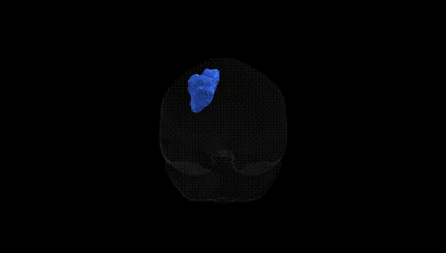
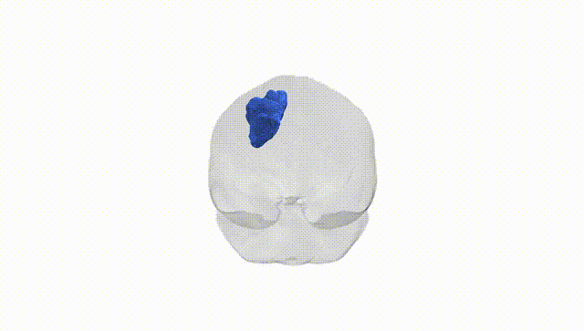

# Superior longitudinal fascicle I left

## Overview

The left superior longitudinal fascicle I (SLF I) is a major intrahemispheric white matter tract within the Pandora-TractSeg atlas, representing the dorsal subdivision of the superior longitudinal fasciculus in the left hemisphere. It courses above the cingulate sulcus and corpus callosum, connecting the superior parietal lobule and dorsal posterior parietal cortex with medial and superior frontal regions, including parts of the dorsomedial premotor and prefrontal cortices. Functionally, SLF I is implicated in higher-order sensorimotor integration, visuospatial processing, attention networks, and aspects of executive control by supporting communication between parietal areas involved in spatial representation and frontal areas involved in planning and cognitive control. There is no direct Wikipedia page for “Superior longitudinal fascicle I,” but a related structure and broader description can be found under the superior longitudinal fasciculus: https://en.wikipedia.org/wiki/Superior_longitudinal_fasciculus

*Overview generated by GPT-4o (2026).*

---

**Region ID:** 40  
**Hemisphere:** left  
**Atlas:** Pandora-TractSeg 

---

## Superior longitudinal fascicle I left – Black Background (Full Brain)

**Full Quality Version:** [Download MP4](full_black.mp4)

---

## Superior longitudinal fascicle I left – White Background (Full Brain)

**Full Quality Version:** [Download MP4](full_white.mp4)

---

## Superior longitudinal fascicle I left – Black Background (Hemisphere)

**Full Quality Version:** [Download MP4](hemi_black.mp4)

---

## Superior longitudinal fascicle I left – White Background (Hemisphere)

**Full Quality Version:** [Download MP4](hemi_white.mp4)

---

## Triplanar View – T1 Background

---

## Triplanar View – Ghost Brain


