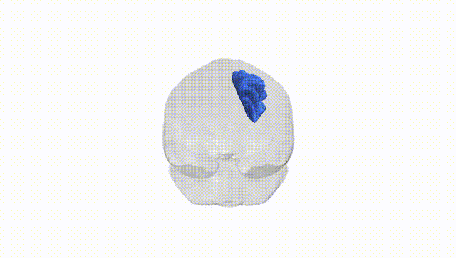
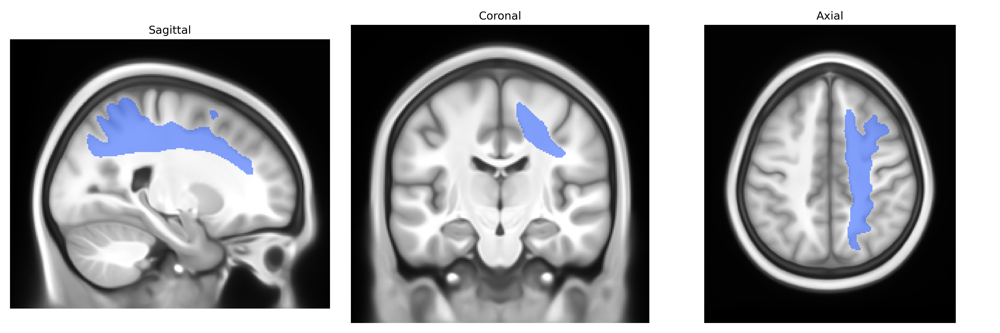

# Superior longitudinal fascicle I right

## Overview

The Superior longitudinal fascicle I right (SLF I R) is the right-hemispheric component of the most dorsal subdivision of the superior longitudinal fasciculus, a major association white matter pathway that interconnects frontal and parietal cortices. SLF I predominantly runs within the superior parietal and dorsal frontal white matter, linking regions such as the superior parietal lobule and dorsal premotor and supplementary motor areas, and is implicated in visuospatial attention, sensorimotor integration, and higher-order motor planning. Within the Pandora-TractSeg Atlas, it is segmented as a distinct tract based on its characteristic dorsomedial trajectory and cortical terminations, separate from the more ventral SLF II and SLF III branches. There is no direct link for this specific subdivision, but it is part of the broader [Superior longitudinal fasciculus](https://en.wikipedia.org/wiki/Superior_longitudinal_fasciculus).

As of current literature up to 2024, there are no robust tract-specific genetic association studies that isolate the Superior longitudinal fascicle I right (SLF I R) as defined in the Pandora‑TractSeg Atlas; most GWAS work on white matter microstructure has analyzed broader SLF regions or global diffusion MRI metrics rather than this specific subdivision. Large-scale diffusion MRI GWAS (e.g., UK Biobank–based studies) have identified numerous loci influencing fractional anisotropy, mean diffusivity, and related measures in frontoparietal and association tracts that likely include portions of SLF, implicating genes involved in axon guidance, myelination, and neural development (such as variants near genes like NTRK1/2, NCAM1, and others), but without clear, reproducible findings targeted to SLF I R alone. Some imaging–genetics and clinical studies have reported associations between SLF (as a broad tract) microstructure and neurodevelopmental, psychiatric, or cognitive phenotypes—such as schizophrenia, ADHD, autism spectrum traits, language and working memory performance—but these generally lack tract-segment resolution and cannot be confidently mapped to SLF I R. Overall, current evidence does not support specific, well-characterized genetic associations uniquely tied to the right SLF I segment defined in the Pandora‑TractSeg Atlas, and tract- and hemisphere-specific genetic architecture for this region remains largely unknown.

*Overview generated by GPT-4o (2026).*

---

**Region ID:** 41  
**Hemisphere:** right  
**Atlas:** Pandora-TractSeg 

---

## Superior longitudinal fascicle I right – Black Background (Full Brain)

**Full Quality Version:** <a href="full_black.mp4" download>Download MP4</a>

---

## Superior longitudinal fascicle I right – White Background (Full Brain)

**Full Quality Version:** <a href="full_white.mp4" download>Download MP4</a>

---

## Triplanar View – T1 Background

---

## Triplanar View – Ghost Brain


