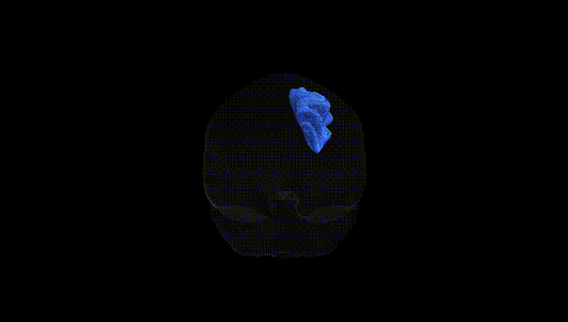
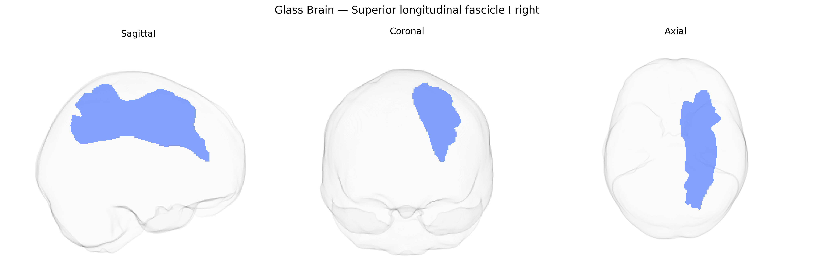

# Superior longitudinal fascicle I right

## Overview

The right Superior longitudinal fascicle I (SLF I) is a major association fiber bundle in the right cerebral hemisphere that forms the dorsal component of the superior longitudinal fasciculus system, interconnecting medial and superior frontal regions (including parts of the superior frontal gyrus and supplementary motor areas) with superior parietal lobule and precuneus. Running within the deep white matter above the cingulum and lateral ventricles, SLF I contributes to higher-order visuospatial processing, attention, motor planning, and integration of parietal sensory information with frontal executive and premotor functions. In the Pandora-TractSeg Atlas, this tract is delineated as a distinct right-hemispheric pathway based on diffusion MRI tractography, reflecting its anatomical course along the dorsal fronto-parietal network and its role in large-scale connectivity supporting goal-directed behavior and spatial cognition.  

Wikipedia URL (for the broader structure “Superior longitudinal fasciculus,” as there is no direct page for “right Superior longitudinal fascicle I”):  
https://en.wikipedia.org/wiki/Superior_longitudinal_fasciculus

*Overview generated by GPT-4o (2026).*

---

**Region ID:** 41  
**Hemisphere:** right  
**Atlas:** Pandora-TractSeg 

---

## Superior longitudinal fascicle I right – Black Background (Full Brain)

**Full Quality Version:** [Download MP4](full_black.mp4)

---

## Superior longitudinal fascicle I right – White Background (Full Brain)

**Full Quality Version:** [Download MP4](full_white.mp4)

---

## Superior longitudinal fascicle I right – Black Background (Hemisphere)

**Full Quality Version:** [Download MP4](hemi_black.mp4)

---

## Superior longitudinal fascicle I right – White Background (Hemisphere)

**Full Quality Version:** [Download MP4](hemi_white.mp4)

---

## Triplanar View – T1 Background

---

## Triplanar View – Ghost Brain


