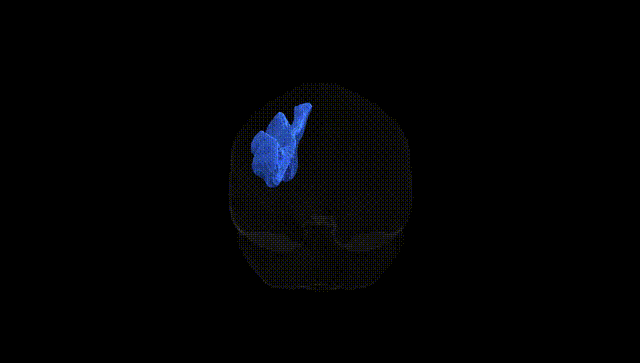
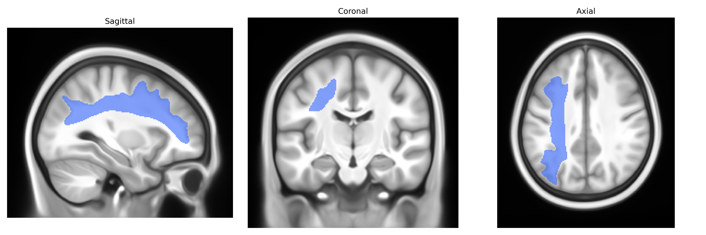
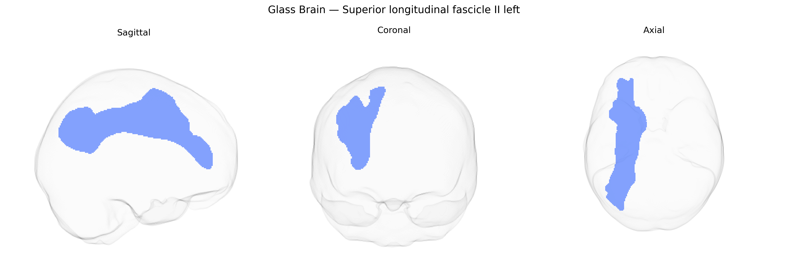

# Superior longitudinal fascicle II left

## Overview

The Superior longitudinal fascicle II (SLF II), left, is a major associative white matter tract running within the dorsal portion of the cerebral hemisphere, interconnecting regions of the parietal and frontal lobes. It originates predominantly in the caudal inferior parietal lobule and extends anteriorly to terminate in the dorsolateral prefrontal cortex, including portions of the middle frontal gyrus. Composed of heavily myelinated fibers, SLF II plays a key role in higher-order cognitive functions such as attention, working memory, and aspects of language and visuospatial processing by facilitating rapid communication between parietal areas involved in multimodal integration and frontal executive regions. In the Pandora-TractSeg Atlas, the left SLF II is delineated as a distinct component of the broader superior longitudinal fasciculus system, reflecting hemispheric specialization often associated with language-dominant functions. There is no direct link specific to “Superior longitudinal fascicle II”; a related article is [Superior longitudinal fasciculus](https://en.wikipedia.org/wiki/Superior_longitudinal_fasciculus).

As of current literature, specific genetic associations for the left Superior Longitudinal Fasciculus II (SLF II) as defined in the Pandora-TractSeg Atlas are sparse, and most diffusion MRI GWAS aggregate measures across broader frontoparietal or SLF-related regions rather than isolating SLF II left. Large-scale imaging–genetics studies (e.g., UK Biobank–based GWAS of white matter microstructure) have identified numerous loci affecting fractional anisotropy, mean diffusivity, and related metrics in association tracts that include or approximate the superior longitudinal fasciculi, with enriched signals in genes involved in axon guidance, myelination, and neurodevelopment (such as those in the CNTN, NCAM, and neuregulin–ErbB pathways), but they rarely parcel the SLF into its classical I/II/III subdivisions. Some work links variation in SLF microstructure broadly to polygenic risk for schizophrenia, ADHD, autism spectrum disorder, and major depressive disorder, as well as to cognitive traits like general intelligence and language-related performance, yet these associations are typically reported for composite SLF masks or “superior longitudinal” tracts, not specifically SLF II left. Consequently, while there is converging genetic evidence implicating the superior longitudinal fasciculi and adjacent frontoparietal white matter in neurodevelopmental and psychiatric liability and in cognitive function, distinct, replicated SNP-level or gene-level associations that are uniquely and explicitly assigned to the Pandora-TractSeg “Superior longitudinal fascicle II left” tract have not been well characterized to date, and current findings should be considered indirect or approximate to that tract.

*Overview generated by GPT-4o (2026).*

---

**Region ID:** 38  
**Hemisphere:** left  
**Atlas:** Pandora-TractSeg 

---

## Superior longitudinal fascicle II left – Black Background (Full Brain)

**Full Quality Version:** <a href="full_black.mp4" download>Download MP4</a>

---

## Superior longitudinal fascicle II left – White Background (Full Brain)

**Full Quality Version:** <a href="full_white.mp4" download>Download MP4</a>

---

## Triplanar View – T1 Background

---

## Triplanar View – Ghost Brain


