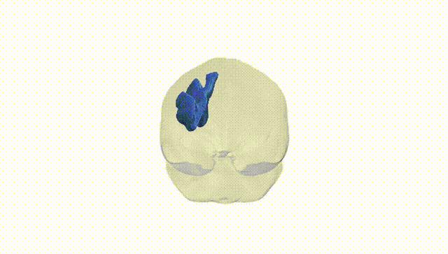

# Superior longitudinal fascicle II left

## Overview

The left Superior longitudinal fascicle II (SLF II) is a major association fiber tract in the left cerebral hemisphere that forms part of the superior longitudinal fasciculus system, interconnecting posterior parietal regions (notably the inferior parietal lobule) with frontal cortical areas, including portions of the dorsolateral prefrontal cortex. It courses dorsally and laterally within the white matter, arching above the insula and lateral ventricle, and contributes to fronto-parietal networks involved in attention, spatial processing, working memory, and higher-order cognitive control. Within diffusion MRI atlases such as the Pandora-TractSeg Atlas, SLF II is segmented based on its characteristic trajectory and connectivity profile, distinguishing it from neighboring SLF subdivisions (SLF I and SLF III) and from the arcuate fasciculus. There is no direct Wikipedia page specifically for “Superior longitudinal fascicle II”; a closely related and encompassing structure is the superior longitudinal fasciculus: https://en.wikipedia.org/wiki/Superior_longitudinal_fasciculus

*Overview generated by GPT-4o (2026).*

---

**Region ID:** 38  
**Hemisphere:** left  
**Atlas:** Pandora-TractSeg 

---

## Superior longitudinal fascicle II left – Black Background (Full Brain)

**Full Quality Version:** [Download MP4](full_black.mp4)

---

## Superior longitudinal fascicle II left – White Background (Full Brain)

**Full Quality Version:** [Download MP4](full_white.mp4)

---

## Superior longitudinal fascicle II left – Black Background (Hemisphere)

**Full Quality Version:** [Download MP4](hemi_black.mp4)

---

## Superior longitudinal fascicle II left – White Background (Hemisphere)

**Full Quality Version:** [Download MP4](hemi_white.mp4)

---

## Triplanar View – T1 Background

---

## Triplanar View – Ghost Brain


