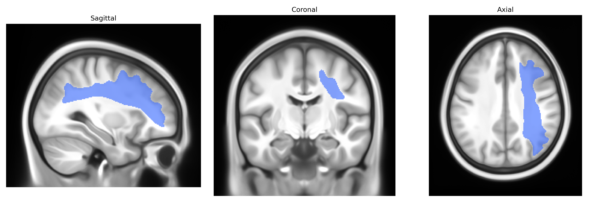

# Superior longitudinal fascicle II right

## Overview

The Superior longitudinal fascicle II right (SLF II R) is a major association white matter tract in the right cerebral hemisphere that runs within the dorsal fronto-parietal pathway, interconnecting the caudal portion of the inferior parietal lobule with the dorsolateral prefrontal cortex, particularly the middle frontal gyrus. It lies lateral to the corona radiata and capsular fibers, coursing longitudinally beneath the supramarginal and angular gyri, and is topographically distinct from SLF I (more dorsal) and SLF III (more ventral and anterior). Functionally, SLF II participates in higher-order cognitive operations including visuospatial attention, working memory, and aspects of language and executive control, by facilitating integration of multimodal sensory information with prefrontal associative processing. There is no direct link for SLF II; a related structure is the [Superior longitudinal fasciculus](https://en.wikipedia.org/wiki/Superior_longitudinal_fasciculus).

As of current literature, specific genetic associations for the right Superior Longitudinal Fascicle II (SLF II) as defined in the Pandora-TractSeg Atlas have not been characterized in a tract-specific manner; most diffusion MRI GWAS and imaging–genetics studies focus on broader SLF measures (often not separating SLF II from other SLF branches or left vs. right) or on global/hemispheric white matter metrics. Large-scale GWAS of diffusion tensor imaging traits (e.g., UK Biobank and ENIGMA) have identified multiple loci and genes influencing fractional anisotropy, mean diffusivity, and related indices in the SLF or frontoparietal association tracts more generally, implicating pathways related to axon guidance, myelination, and neurodevelopment, and linking variation in SLF microstructure to cognitive performance, educational attainment, and risk for psychiatric disorders such as schizophrenia, ADHD, and major depression. However, these findings typically aggregate across SLF subcomponents and do not provide robust, replicated, right-SLF-II–specific genetic associations. Consequently, while it is likely that genetic influences on association white matter and cognition also affect right SLF II microstructure, precise gene–tract mappings and tract-level GWAS results for right SLF II from the Pandora-TractSeg parcellation are currently sparse or absent in the published literature.

*Overview generated by GPT-4o (2026).*

---

**Region ID:** 39  
**Hemisphere:** right  
**Atlas:** Pandora-TractSeg 

---

## Superior longitudinal fascicle II right – Black Background (Full Brain)

**Full Quality Version:** <a href="full_black.mp4" download>Download MP4</a>

---

## Superior longitudinal fascicle II right – White Background (Full Brain)

**Full Quality Version:** <a href="full_white.mp4" download>Download MP4</a>

---

## Triplanar View – T1 Background

---

## Triplanar View – Ghost Brain


