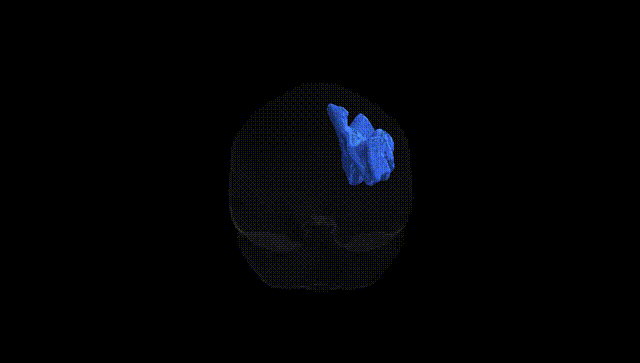
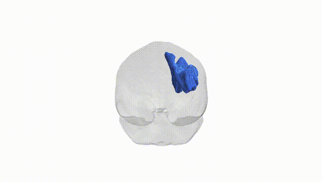
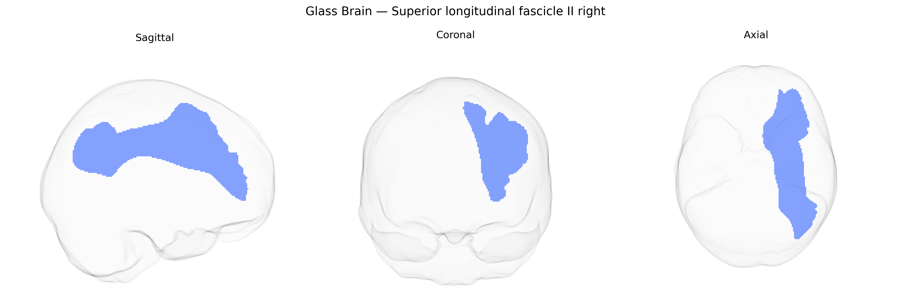

# Superior longitudinal fascicle II right

## Overview

The right Superior longitudinal fascicle II (SLF II) is a major association fiber tract in the right hemisphere that links the posterior parietal cortex—particularly regions around the inferior parietal lobule—with the dorsolateral prefrontal cortex, running lateral to the centrum semiovale and arching above the Sylvian fissure. It is considered a subdivision of the superior longitudinal fasciculus complex, with distinct cortical terminations and trajectories relative to SLF I and SLF III. Functionally, SLF II is implicated in higher-order cognitive processes including attention, spatial awareness, working memory, and aspects of language and executive control, supporting integration of multimodal sensory information with prefrontal planning and decision-making operations. There is no direct Wikipedia entry for “Superior longitudinal fascicle II” as a separate page; a closely related and encompassing structure is described at: https://en.wikipedia.org/wiki/Superior_longitudinal_fasciculus

*Overview generated by GPT-4o (2026).*

---

**Region ID:** 39  
**Hemisphere:** right  
**Atlas:** Pandora-TractSeg 

---

## Superior longitudinal fascicle II right – Black Background (Full Brain)

**Full Quality Version:** [Download MP4](full_black.mp4)

---

## Superior longitudinal fascicle II right – White Background (Full Brain)

**Full Quality Version:** [Download MP4](full_white.mp4)

---

## Superior longitudinal fascicle II right – Black Background (Hemisphere)

**Full Quality Version:** [Download MP4](hemi_black.mp4)

---

## Superior longitudinal fascicle II right – White Background (Hemisphere)

**Full Quality Version:** [Download MP4](hemi_white.mp4)

---

## Triplanar View – T1 Background

---

## Triplanar View – Ghost Brain


