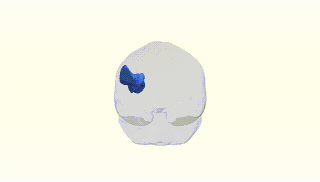
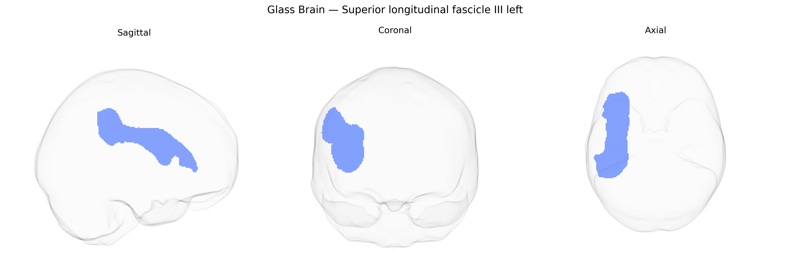

# Superior longitudinal fascicle III left

## Overview

The Superior longitudinal fascicle III (SLF III) left is a major association white matter tract that interconnects the inferior parietal lobule with lateral frontal regions, particularly ventral premotor and inferior frontal cortices, within the left hemisphere. As the ventral component of the superior longitudinal fasciculus system, SLF III contributes to the integration of sensorimotor, attentional, and higher-order cognitive processes, including aspects of language and praxis, by enabling rapid bidirectional communication between posterior parietal multimodal association areas and frontal executive and premotor regions. It courses laterally to the corona radiata and internal capsule, following the contour of the insula and opercular regions, and is topographically distinct yet closely related to other SLF subcomponents (SLF I and II) and the arcuate fasciculus. There is no direct Wikipedia article for Superior longitudinal fascicle III; a related page is [Superior longitudinal fasciculus](https://en.wikipedia.org/wiki/Superior_longitudinal_fasciculus).

As of 2024, there are no well-replicated, tract-specific genetic associations published that are uniquely and definitively assigned to the left Superior longitudinal fascicle III (SLF III) as defined in the Pandora‑TractSeg Atlas; most large diffusion MRI GWAS analyze broader SLF regions or lobar/whole-brain measures rather than this fine-grained subdivision. Broadly, diffusion tensor imaging measures (e.g., fractional anisotropy and mean diffusivity) in SLF-containing regions show polygenic influences with significant SNP heritability, and several large GWAS have identified associations between white matter microstructure in frontoparietal tracts and variants near genes involved in neurodevelopment, axon guidance, and myelination (such as genes related to oligodendrocyte function and cytoskeletal organization), but these are commonly reported at the level of composite SLF segments or global white matter factors rather than SLF III specifically. SLF integrity more generally has been implicated, via imaging-genetic or candidate-gene work, in cognitive traits (working memory, language functions, attention) and in neurodevelopmental and psychiatric conditions including autism spectrum disorder, ADHD, schizophrenia, and dyslexia, yet these studies typically do not isolate SLF III or map associations onto the Pandora‑TractSeg parcellation. Consequently, current knowledge about genetic influences on the left SLF III tract, as precisely defined in that atlas, is indirect, extrapolated from broader SLF or frontoparietal white matter findings, and lacks tract- and hemisphere-specific GWAS results or robust disorder-linked variants.

*Overview generated by GPT-4o (2026).*

---

**Region ID:** 36  
**Hemisphere:** left  
**Atlas:** Pandora-TractSeg 

---

## Superior longitudinal fascicle III left – Black Background (Full Brain)

**Full Quality Version:** <a href="full_black.mp4" download>Download MP4</a>

---

## Superior longitudinal fascicle III left – White Background (Full Brain)

**Full Quality Version:** <a href="full_white.mp4" download>Download MP4</a>

---

## Triplanar View – T1 Background

---

## Triplanar View – Ghost Brain


