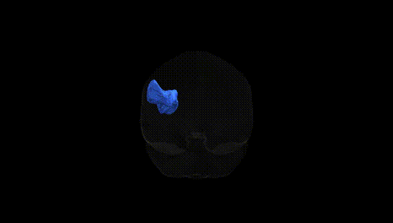
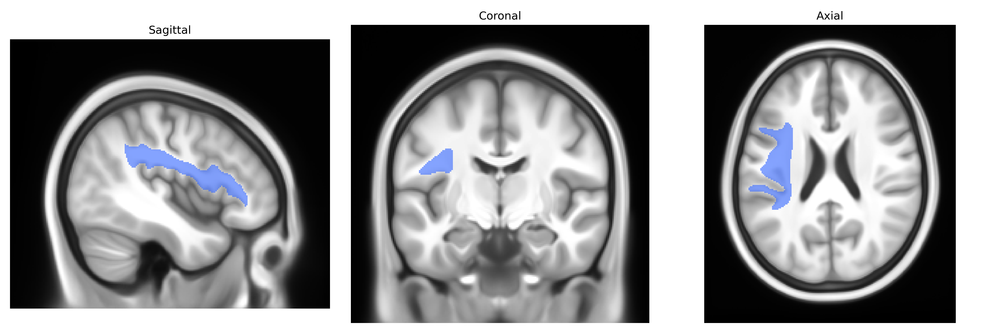

# Superior longitudinal fascicle III left

## Overview

The left Superior longitudinal fascicle III (SLF III) is a major association fiber tract within the left hemisphere that forms part of the superior longitudinal fasciculus system, interconnecting inferior parietal regions (particularly the supramarginal gyrus) with inferior frontal cortical areas, including ventral premotor and parts of the inferior frontal gyrus. Composed of myelinated axons running in an anteroposterior trajectory lateral to the corona radiata, this tract contributes to sensorimotor integration, language-related functions (such as phonological and articulatory processing), and higher-order visuospatial and attentional mechanisms. SLF III is differentiated from other SLF components (I, II, and the arcuate fasciculus) by its more ventral course and specific parietal–frontal connectivity, and is typically studied using diffusion MRI tractography in atlases such as Pandora-TractSeg to characterize its microstructural properties and hemispheric asymmetries. There is no direct Wikipedia link for “Superior longitudinal fascicle III”; a closely related entry is the general superior longitudinal fasciculus: https://en.wikipedia.org/wiki/Superior_longitudinal_fasciculus

*Overview generated by GPT-4o (2026).*

---

**Region ID:** 36  
**Hemisphere:** left  
**Atlas:** Pandora-TractSeg 

---

## Superior longitudinal fascicle III left – Black Background (Full Brain)

**Full Quality Version:** [Download MP4](full_black.mp4)

---

## Superior longitudinal fascicle III left – White Background (Full Brain)

**Full Quality Version:** [Download MP4](full_white.mp4)

---

## Superior longitudinal fascicle III left – Black Background (Hemisphere)

**Full Quality Version:** [Download MP4](hemi_black.mp4)

---

## Superior longitudinal fascicle III left – White Background (Hemisphere)

**Full Quality Version:** [Download MP4](hemi_white.mp4)

---

## Triplanar View – T1 Background

---

## Triplanar View – Ghost Brain


