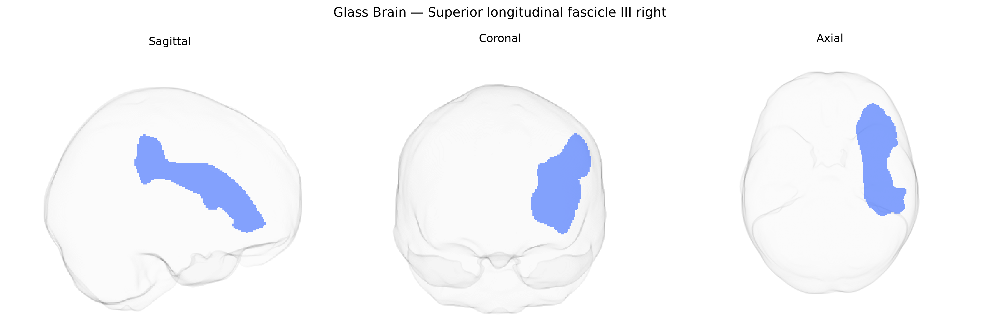

# Superior longitudinal fascicle III right

## Overview

The Superior longitudinal fascicle III right (SLF III R) is a major association white matter tract in the right cerebral hemisphere that forms part of the superior longitudinal fasciculus system, interconnecting inferior parietal regions with ventral frontal areas, including portions of the inferior frontal gyrus. It courses laterally above the insula and contributes to fronto-parietal networks involved in attention, language, and higher-order sensorimotor integration, particularly in integrating somatosensory information with articulatory and executive functions. In the Pandora-TractSeg Atlas, SLF III R is delineated based on diffusion MRI tractography, allowing quantification of its microstructural properties and connectivity patterns within the broader fronto-parietal association fiber system. There is no direct link for this subcomponent; see the related structure [Superior longitudinal fasciculus](https://en.wikipedia.org/wiki/Superior_longitudinal_fasciculus).

As of 2024, there are no well-established, tract-specific genetic findings reported in the literature that uniquely implicate the right Superior Longitudinal Fasciculus III (SLF III) from the Pandora-TractSeg Atlas; large diffusion MRI GWAS have typically treated SLF subdivisions more coarsely or combined them across hemispheres, and most published genetic associations reference global or lobar white matter measures rather than this specific segment. Broadly, diffusion tensor imaging studies show that fractional anisotropy (FA) and mean diffusivity (MD) in SLF regions are heritable and polygenic, with loci enriched in genes involved in axon guidance, myelination, and neurodevelopment (for example, variants near genes such as CNTN4, ROBO1/2, and NCAM family members in some white-matter and language-related GWAS), but these associations are not resolved to SLF III right alone. SLF-related tracts more generally have been implicated in genetic liability to neurodevelopmental and psychiatric conditions—such as ADHD, dyslexia, schizophrenia, and autism—through case–control diffusion MRI studies and polygenic score analyses, where altered FA or MD in frontoparietal white matter, including SLF territory, associates with higher polygenic risk, yet these effects remain anatomically coarse and not specific to SLF III right. Overall, current evidence supports substantial genetic influence on microstructural variability in SLF territory, but tract- and hemisphere-specific genetic associations for the right SLF III, particularly in the Pandora-TractSeg definition, are not yet clearly characterized in published GWAS.

*Overview generated by GPT-4o (2026).*

---

**Region ID:** 37  
**Hemisphere:** right  
**Atlas:** Pandora-TractSeg 

---

## Superior longitudinal fascicle III right – Black Background (Full Brain)

**Full Quality Version:** <a href="full_black.mp4" download>Download MP4</a>

---

## Superior longitudinal fascicle III right – White Background (Full Brain)

**Full Quality Version:** <a href="full_white.mp4" download>Download MP4</a>

---

## Triplanar View – T1 Background

---

## Triplanar View – Ghost Brain


