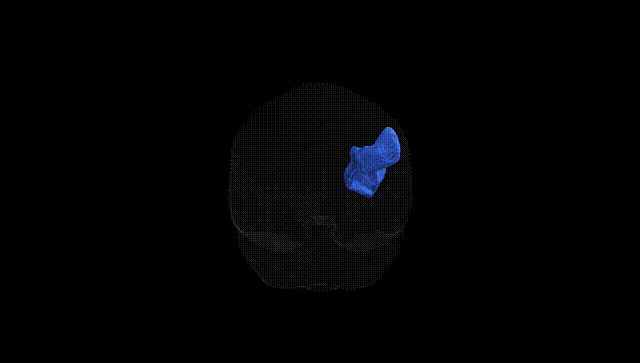
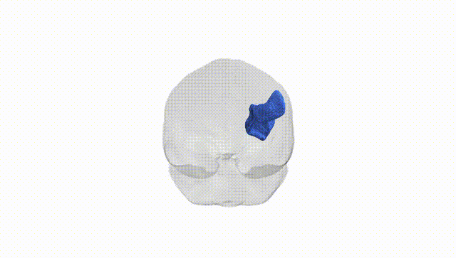
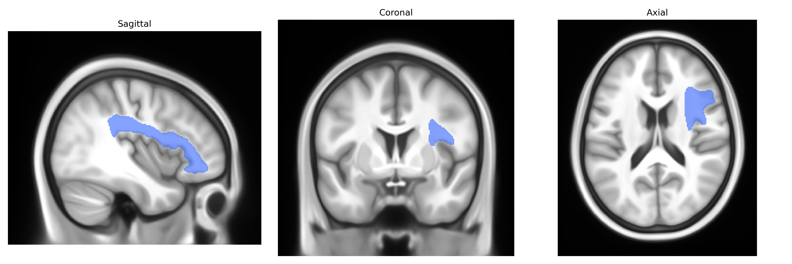

# Superior longitudinal fascicle III right

## Overview

The right Superior Longitudinal Fascicle III (SLF III) is a major association fiber tract in the right hemisphere that connects the inferior parietal lobule (including supramarginal gyrus) with ventral premotor and inferior frontal regions, running laterally within the fronto-parietal white matter. It is considered the ventral component of the superior longitudinal fasciculus complex and is particularly implicated in visuomotor integration, spatial attention, and aspects of language-related functions such as phonological processing and articulation planning, often in interaction with perisylvian networks. In diffusion MRI–based atlases such as the Pandora-TractSeg Atlas, SLF III is delineated as a distinct bundle based on its trajectory and cortical endpoints, and its microstructural properties (e.g., fractional anisotropy, mean diffusivity) are commonly studied as markers of fronto-parietal connectivity and lateralized cognitive functions. There is no direct Wikipedia page for “Superior longitudinal fascicle III”; a related and encompassing structure is described here: https://en.wikipedia.org/wiki/Superior_longitudinal_fasciculus

*Overview generated by GPT-4o (2026).*

---

**Region ID:** 37  
**Hemisphere:** right  
**Atlas:** Pandora-TractSeg 

---

## Superior longitudinal fascicle III right – Black Background (Full Brain)

**Full Quality Version:** [Download MP4](full_black.mp4)

---

## Superior longitudinal fascicle III right – White Background (Full Brain)

**Full Quality Version:** [Download MP4](full_white.mp4)

---

## Superior longitudinal fascicle III right – Black Background (Hemisphere)

**Full Quality Version:** [Download MP4](hemi_black.mp4)

---

## Superior longitudinal fascicle III right – White Background (Hemisphere)

**Full Quality Version:** [Download MP4](hemi_white.mp4)

---

## Triplanar View – T1 Background

---

## Triplanar View – Ghost Brain


