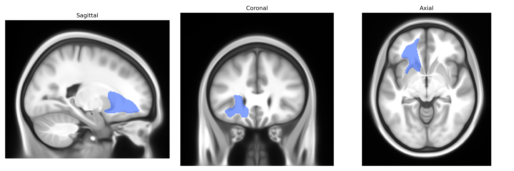

# Striato-fronto-orbital left

## Overview

The Striato-fronto-orbital left white matter tract, as defined in the Pandora-TractSeg Atlas, comprises association fibers connecting the striatum—primarily components of the dorsal striatum such as the caudate nucleus and putamen—with regions of the orbitofrontal cortex in the left hemisphere. This pathway participates in cortico-striatal loops that integrate reward, affective, and decision-related information, contributing to the modulation of goal-directed behavior, valuation, and inhibitory control. Fibers in this tract course through the deep frontal white matter, linking basal ganglia structures with the inferior frontal and orbital gyri, and interact functionally with broader frontostriatal and limbic networks implicated in motivation and executive function. There is no direct link; a related structure is the [Orbitofrontal cortex](https://en.wikipedia.org/wiki/Orbitofrontal_cortex).

As of 2024, there are no published genetic association studies that specifically target the “Striato-fronto-orbital left” white matter tract as defined in the Pandora-TractSeg Atlas, and no GWAS has reported tract-level associations explicitly under this label. However, large diffusion MRI GWAS (e.g., UK Biobank–based studies) have identified numerous loci associated with global and regional measures of white matter microstructure, such as fractional anisotropy and mean diffusivity, in frontal and fronto-striatal pathways more broadly, implicating genes involved in axon guidance (e.g., ROBO1/2, SLIT3), myelination and oligodendrocyte function (e.g., MAG, MBP, PLP1), and neuronal development (e.g., NRG1, CNTN4). These studies also show genetic correlations between fronto-striatal white matter integrity and a range of neuropsychiatric and cognitive traits, including schizophrenia, major depressive disorder, ADHD, and general cognitive ability, as well as substance use, but the associations are typically reported at the level of lobar tracts or major bundles rather than the specific Striato-fronto-orbital connection. Consequently, while there is strong evidence that fronto-striatal and orbitofrontal white matter organization is heritable and genetically linked to psychiatric and cognitive phenotypes, direct, tract-specific genetic findings for the Striato-fronto-orbital left tract in the Pandora-TractSeg Atlas remain sparse or unreported.

*Overview generated by GPT-4o (2026).*

---

**Region ID:** 42  
**Hemisphere:** left  
**Atlas:** Pandora-TractSeg 

---

## Striato-fronto-orbital left – Black Background (Full Brain)

**Full Quality Version:** <a href="full_black.mp4" download>Download MP4</a>

---

## Striato-fronto-orbital left – White Background (Full Brain)

**Full Quality Version:** <a href="full_white.mp4" download>Download MP4</a>

---

## Triplanar View – T1 Background

---

## Triplanar View – Ghost Brain


