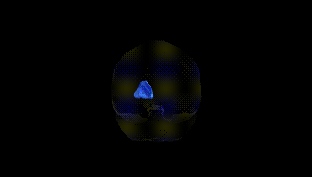
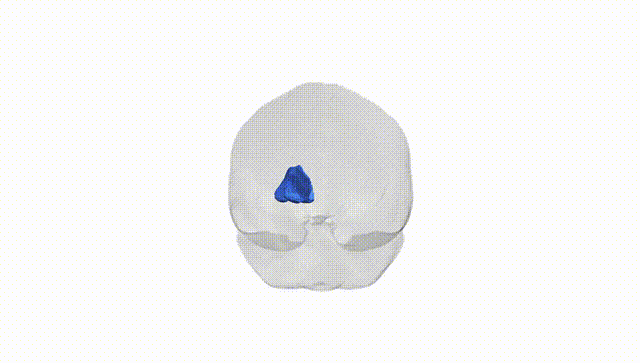
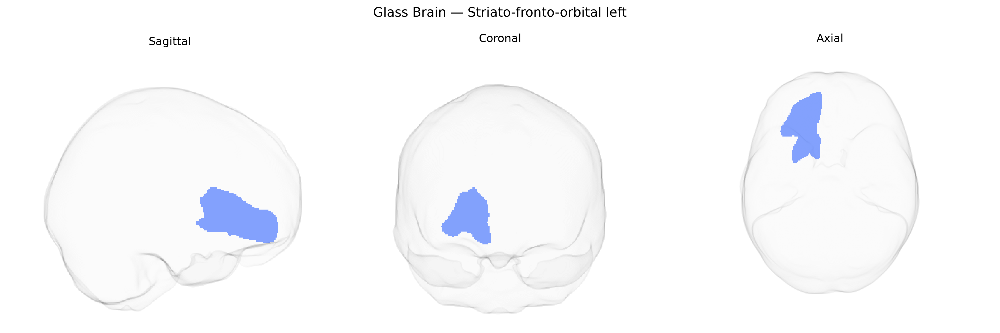

# Striato-fronto-orbital left

## Overview

The left striato-fronto-orbital tract in the Pandora-TractSeg atlas refers to a white matter pathway linking the striatum (particularly components of the basal ganglia such as the caudate nucleus and putamen) with regions of the orbitofrontal cortex in the left cerebral hemisphere. This pathway is part of the broader frontostriatal circuitry, which supports functions including reward processing, decision-making, motivation, and aspects of affective and cognitive control. Afferent and efferent projections between the striatum and orbitofrontal cortex integrate dopaminergic and cortical inputs, modulating goal-directed behavior and evaluating the emotional and motivational significance of stimuli. Disruptions in frontostriatal and orbitofrontal connectivity have been implicated in neuropsychiatric conditions such as obsessive–compulsive disorder, addiction, and mood disorders. There is no direct Wikipedia article for the “left striato-fronto-orbital” tract; a closely related and encompassing structure is the orbitofrontal cortex: https://en.wikipedia.org/wiki/Orbitofrontal_cortex

*Overview generated by GPT-4o (2026).*

---

**Region ID:** 42  
**Hemisphere:** left  
**Atlas:** Pandora-TractSeg 

---

## Striato-fronto-orbital left – Black Background (Full Brain)

**Full Quality Version:** [Download MP4](full_black.mp4)

---

## Striato-fronto-orbital left – White Background (Full Brain)

**Full Quality Version:** [Download MP4](full_white.mp4)

---

## Striato-fronto-orbital left – Black Background (Hemisphere)

**Full Quality Version:** [Download MP4](hemi_black.mp4)

---

## Striato-fronto-orbital left – White Background (Hemisphere)

**Full Quality Version:** [Download MP4](hemi_white.mp4)

---

## Triplanar View – T1 Background

---

## Triplanar View – Ghost Brain


