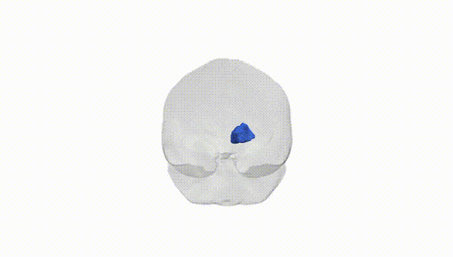
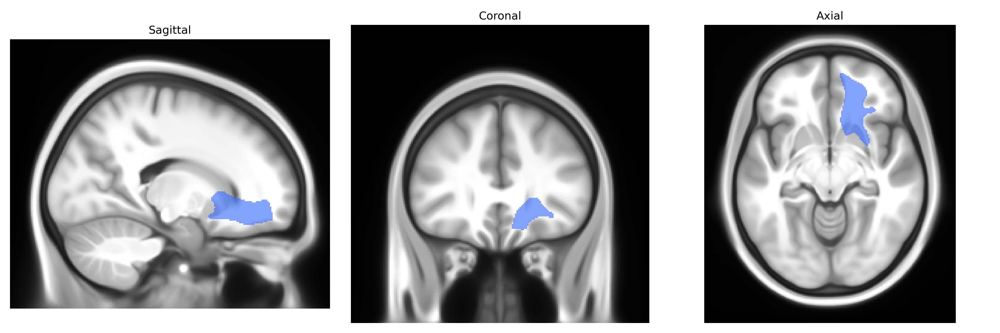
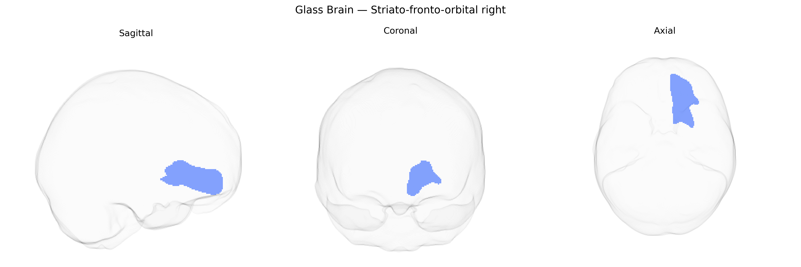

# Striato-fronto-orbital right

## Overview

The striato-fronto-orbital right white matter tract, as defined in the Pandora-TractSeg Atlas, comprises association fibers connecting the striatum—particularly regions of the caudate and putamen—to orbitofrontal portions of the prefrontal cortex in the right hemisphere. This pathway participates in cortico-basal ganglia loops implicated in reward processing, decision-making, and affective evaluation, relaying information between limbic and cognitive territories of the basal ganglia and the orbitofrontal cortex. Fibers course anteriorly from the striatum through the deep frontal white matter, integrating with neighboring prefrontal projection systems and ultimately reaching orbitofrontal gyri on the ventral surface of the frontal lobe. This tract is closely related to the broader frontostriatal circuitry and orbitofrontal projections that modulate motivation, reinforcement learning, and goal-directed behavior. There is no direct link; a related structure is the [Orbitofrontal cortex](https://en.wikipedia.org/wiki/Orbitofrontal_cortex).

As of 2024, there are no tract-specific genetic association studies or GWAS results published that directly target the “Striato-fronto-orbital right” white matter tract as defined in the Pandora‑TractSeg Atlas, and this pathway is not individually reported in large diffusion MRI GWAS catalogs. However, genome-wide studies of diffusion tensor imaging measures—such as fractional anisotropy and mean diffusivity—in frontostriatal and orbitofrontal–striatal regions more broadly have identified polygenic influences and associations with genes involved in neurodevelopment, axon guidance, and myelination (for example, variants near genes such as NCAM1, CNTN4, and NTRK family members in fronto–striatal circuits), and these circuits are frequently implicated in psychiatric and neurodevelopmental disorders including schizophrenia, attention-deficit/hyperactivity disorder, obsessive–compulsive disorder, and mood disorders. Large consortia (e.g., ENIGMA and UK Biobank–based studies) show that white matter microstructure in frontostriatal pathways is moderately heritable and genetically correlated with cognitive performance, risk-taking, and multiple psychiatric traits, but current data do not resolve effects down to the specific “Striato-fronto-orbital right” tract label used in the Pandora‑TractSeg Atlas, so any genetic associations at that exact tract level remain uncharacterized.

*Overview generated by GPT-4o (2026).*

---

**Region ID:** 43  
**Hemisphere:** right  
**Atlas:** Pandora-TractSeg 

---

## Striato-fronto-orbital right – Black Background (Full Brain)

**Full Quality Version:** <a href="full_black.mp4" download>Download MP4</a>

---

## Striato-fronto-orbital right – White Background (Full Brain)

**Full Quality Version:** <a href="full_white.mp4" download>Download MP4</a>

---

## Triplanar View – T1 Background

---

## Triplanar View – Ghost Brain


