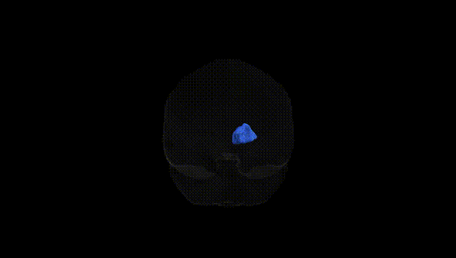

# Striato-fronto-orbital right

## Overview

The right striato-fronto-orbital tract (Pandora-TractSeg Atlas) is a frontostriatal white-matter pathway connecting components of the striatum (principally the caudate nucleus and putamen) with the orbitofrontal cortex in the right cerebral hemisphere. This tract supports integration of reward-related, motivational, and affective information with executive and decision-making processes mediated by the orbitofrontal cortex. Functionally, it is implicated in reinforcement learning, evaluation of action outcomes, behavioral flexibility, and the modulation of goal-directed behavior based on changing environmental contingencies. Disruption or dysregulation of this frontostriatal circuitry has been associated with various neuropsychiatric conditions, including obsessive–compulsive disorder, addiction, and mood disorders, where abnormalities in reward valuation and inhibitory control are prominent. There is no direct Wikipedia page for the “right striato-fronto-orbital” tract; a closely related structure is the orbitofrontal cortex: https://en.wikipedia.org/wiki/Orbitofrontal_cortex

*Overview generated by GPT-4o (2026).*

---

**Region ID:** 43  
**Hemisphere:** right  
**Atlas:** Pandora-TractSeg 

---

## Striato-fronto-orbital right – Black Background (Full Brain)

**Full Quality Version:** [Download MP4](full_black.mp4)

---

## Striato-fronto-orbital right – White Background (Full Brain)

**Full Quality Version:** [Download MP4](full_white.mp4)

---

## Striato-fronto-orbital right – Black Background (Hemisphere)

**Full Quality Version:** [Download MP4](hemi_black.mp4)

---

## Striato-fronto-orbital right – White Background (Hemisphere)

**Full Quality Version:** [Download MP4](hemi_white.mp4)

---

## Triplanar View – T1 Background

---

## Triplanar View – Ghost Brain


