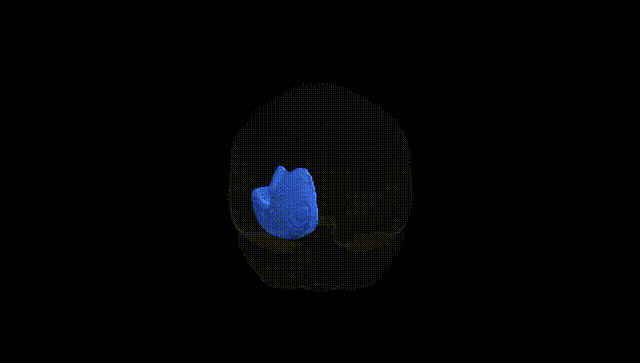
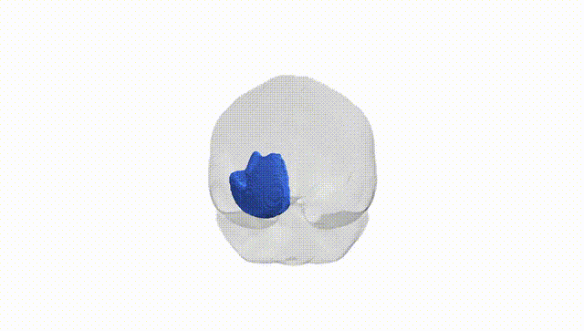
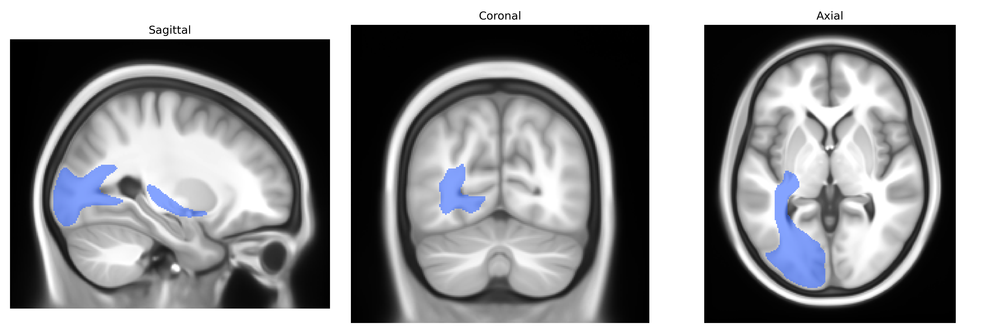
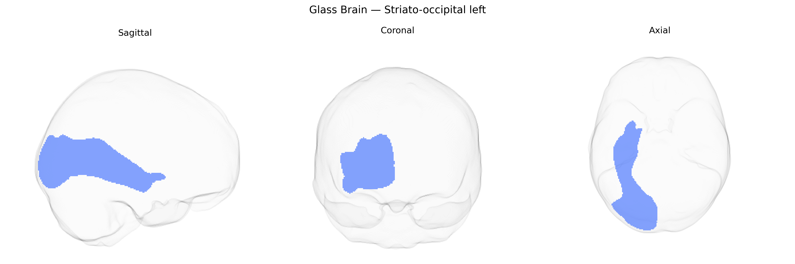

# Striato-occipital left

## Overview

The left striato-occipital tract is a white matter pathway connecting components of the striatum in the basal ganglia (primarily the caudate nucleus and putamen) with occipital cortical regions involved in visual processing. Functionally, this tract is thought to contribute to the integration of visual information with motor, cognitive, and reward-related processes mediated by the basal ganglia, supporting visuomotor coordination, visual attention, and potentially learning based on visual feedback. Structurally, it courses from deep gray matter nuclei of the telencephalon toward posterior cortical areas, traversing portions of the internal capsule and adjacent white matter. Damage or disruption to this tract may alter the modulation of visual signals within cortico-striato-thalamo-cortical loops, with possible consequences for visually guided behavior and higher-order visual cognition. There is no direct Wikipedia page for the “striato-occipital” tract; a closely related structure with relevant information is the striatum: https://en.wikipedia.org/wiki/Striatum

*Overview generated by GPT-4o (2026).*

---

**Region ID:** 44  
**Hemisphere:** left  
**Atlas:** Pandora-TractSeg 

---

## Striato-occipital left – Black Background (Full Brain)

**Full Quality Version:** [Download MP4](full_black.mp4)

---

## Striato-occipital left – White Background (Full Brain)

**Full Quality Version:** [Download MP4](full_white.mp4)

---

## Striato-occipital left – Black Background (Hemisphere)

**Full Quality Version:** [Download MP4](hemi_black.mp4)

---

## Striato-occipital left – White Background (Hemisphere)

**Full Quality Version:** [Download MP4](hemi_white.mp4)

---

## Triplanar View – T1 Background

---

## Triplanar View – Ghost Brain


