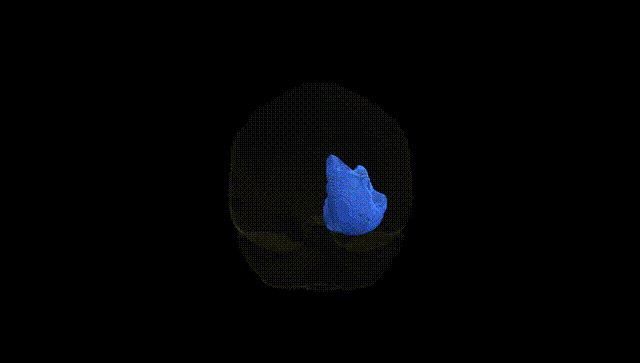
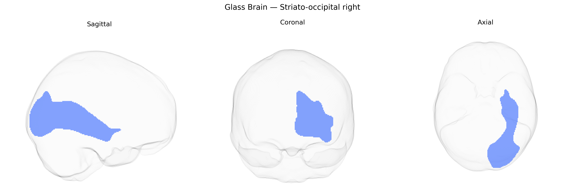

# Striato-occipital right

## Overview

The Striato-occipital right white matter tract, as defined in the Pandora-TractSeg Atlas, is a long-range association pathway connecting the striatum—primarily components of the basal ganglia such as the caudate nucleus and putamen—to regions of the occipital lobe involved in visual processing. This tract is thought to integrate subcortical motor, reward, and cognitive signals from the striatum with occipital cortical areas that process visual information, potentially contributing to visually guided behavior, visuomotor integration, and context-dependent modulation of visual perception. Fibers course in the deep white matter lateral to the ventricular system and may overlap or run in proximity with other associative and projection systems passing between frontal, parietal, and occipital regions. There is no direct link for this specific tract; a closely related structure is the [Basal ganglia](https://en.wikipedia.org/wiki/Basal_ganglia).

As of 2024, there appear to be no tract-specific genetic association studies or GWAS reports targeting the “Striato-occipital right” white matter tract as defined in the Pandora-TractSeg Atlas, and this tract is not commonly analyzed as a distinct unit in major diffusion MRI GWAS. Large-scale imaging–genetics studies (e.g., UK Biobank–based GWAS of diffusion metrics) have identified numerous loci influencing global or regional white matter microstructure—especially fractional anisotropy and mean diffusivity in fronto-occipital, occipital, and striatal connection pathways—but these findings are typically reported for broader tracts (e.g., inferior fronto-occipital fasciculus, optic radiations, or composite occipital/striatal ROIs) rather than a discrete “striato-occipital” bundle. Genetic effects on white matter integrity in striatal and occipital regions have been linked to neuropsychiatric and neurodevelopmental disorders (such as schizophrenia, ADHD, and autism spectrum disorders), cognitive performance, and brain aging, but attribution to this specific tract is indirect and inferred from its anatomical connections rather than demonstrated by tract-level GWAS. Consequently, current knowledge about genetic associations uniquely and explicitly assigned to the right striato-occipital tract in the Pandora-TractSeg Atlas is minimal, and its genetic architecture must be extrapolated from more general findings on striatal and occipital white matter pathways.

*Overview generated by GPT-4o (2026).*

---

**Region ID:** 45  
**Hemisphere:** right  
**Atlas:** Pandora-TractSeg 

---

## Striato-occipital right – Black Background (Full Brain)

**Full Quality Version:** <a href="full_black.mp4" download>Download MP4</a>

---

## Striato-occipital right – White Background (Full Brain)

**Full Quality Version:** <a href="full_white.mp4" download>Download MP4</a>

---

## Triplanar View – T1 Background

---

## Triplanar View – Ghost Brain


