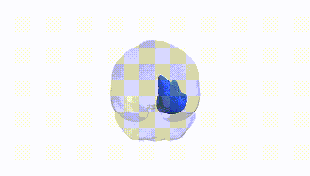
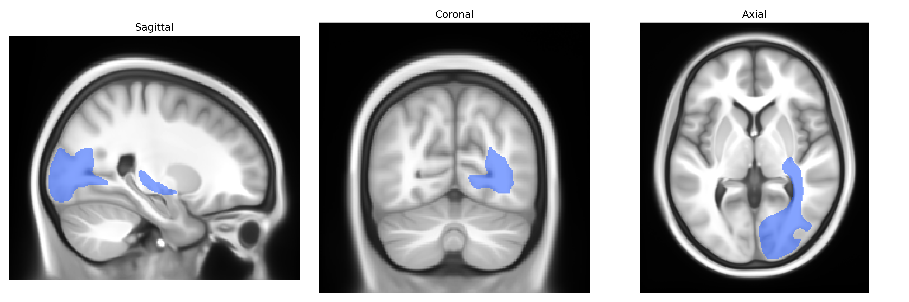

# Striato-occipital right

## Overview

The right striato-occipital tract, as defined in the Pandora-TractSeg Atlas, is a white matter pathway in the right hemisphere that connects portions of the striatum (primarily the caudate nucleus and putamen within the basal ganglia) to regions of the occipital lobe. This tract is thought to contribute to the integration of visual information with subcortical motor and cognitive circuits, enabling visuomotor coordination, visual habit learning, and possibly aspects of reward-based modulation of visual processing. It courses from the deep gray nuclei of the basal ganglia through the surrounding white matter to terminate in occipital cortical areas involved in basic and higher-order visual functions. There is no direct Wikipedia page for the “right striato-occipital” tract; a related structure and region can be found here: https://en.wikipedia.org/wiki/Basal_ganglia

*Overview generated by GPT-4o (2026).*

---

**Region ID:** 45  
**Hemisphere:** right  
**Atlas:** Pandora-TractSeg 

---

## Striato-occipital right – Black Background (Full Brain)

**Full Quality Version:** [Download MP4](full_black.mp4)

---

## Striato-occipital right – White Background (Full Brain)

**Full Quality Version:** [Download MP4](full_white.mp4)

---

## Striato-occipital right – Black Background (Hemisphere)

**Full Quality Version:** [Download MP4](hemi_black.mp4)

---

## Striato-occipital right – White Background (Hemisphere)

**Full Quality Version:** [Download MP4](hemi_white.mp4)

---

## Triplanar View – T1 Background

---

## Triplanar View – Ghost Brain


