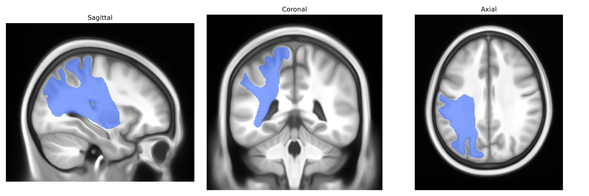
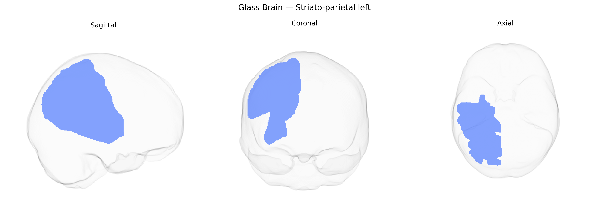

# Striato-parietal left

## Overview

The Striato-parietal left white matter tract, as defined in the Pandora-TractSeg Atlas, is a cortico-subcortical projection pathway connecting the dorsal striatum (primarily the caudate nucleus and putamen) with regions of the posterior parietal cortex in the left hemisphere. This tract conveys information related to sensorimotor integration, spatial attention, and higher-order action planning, supporting the coordination of parietal spatial representations with striatal circuits involved in motor selection, habit formation, and procedural learning. Fibers course superiorly from the basal ganglia through the internal capsule and corona radiata before fanning out toward parietal association areas, integrating basal ganglia output with parietal networks that contribute to visuomotor transformations and goal-directed behavior. There is no direct Wikipedia article for this specific tract; a related structure is the [Basal ganglia](https://en.wikipedia.org/wiki/Basal_ganglia).

As of 2024, there are no tract-specific genetic association studies focused explicitly on the “Striato-parietal left” white matter tract as defined in the Pandora-TractSeg Atlas, and no GWAS has reported variants uniquely or definitively tied to this tract by name. Most relevant evidence comes from large diffusion MRI GWAS of global or regional white matter microstructure (e.g., FA, MD, RD, AD) that aggregate across many tracts, including corticostriatal and parietal association pathways, and identify widespread polygenic influences on white matter integrity. These studies have repeatedly implicated genes involved in axon guidance, myelination, and neurodevelopment (such as variants near genes involved in oligodendrocyte function, cell adhesion, and synaptic signaling) and have linked white matter measures to cognitive performance, educational attainment, neuroticism, and risk for disorders including schizophrenia, major depressive disorder, bipolar disorder, and ADHD. However, because the Pandora-TractSeg striato-parietal tract is a relatively fine-grained, atlas-specific parcellation, current literature does not provide clear, tract-level genetic associations, and any genetic links to this structure are inferred only indirectly from broader corticostriatal and parietal white matter findings.

*Overview generated by GPT-4o (2026).*

---

**Region ID:** 46  
**Hemisphere:** left  
**Atlas:** Pandora-TractSeg 

---

## Striato-parietal left – Black Background (Full Brain)

**Full Quality Version:** <a href="full_black.mp4" download>Download MP4</a>

---

## Striato-parietal left – White Background (Full Brain)

**Full Quality Version:** <a href="full_white.mp4" download>Download MP4</a>

---

## Triplanar View – T1 Background

---

## Triplanar View – Ghost Brain


