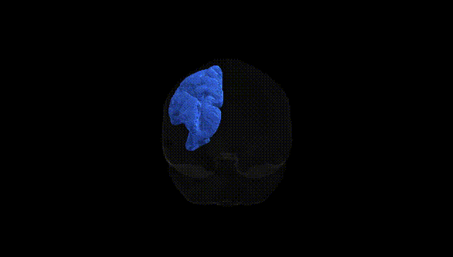
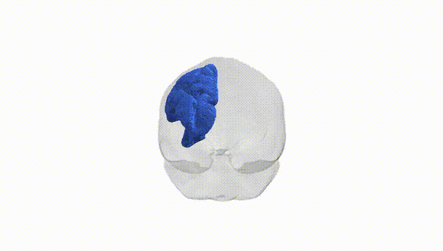

# Striato-parietal left

## Overview

The left striato-parietal region in the Pandora-TractSeg atlas refers to a lateralized white-matter connection system linking the dorsal striatum—principally the caudate nucleus and putamen—with parietal cortical areas, including portions of the superior and inferior parietal lobules. Anatomically, this tract complex courses superiorly and posteriorly from the striatum, integrating subcortical basal ganglia circuits with parietal association cortices involved in sensorimotor integration, spatial attention, and aspects of goal-directed behavior. Functionally, the striato-parietal projections are thought to contribute to the coordination of movement with sensory and spatial information, modulation of attention across the visual field, and integration of reward or action-selection signals from the basal ganglia into parietal decision-making networks. There is no direct Wikipedia link for the “left striato-parietal” tract or functional group as defined in the Pandora-TractSeg atlas; a closely related structure and network component is the parietal lobe: https://en.wikipedia.org/wiki/Parietal_lobe.

*Overview generated by GPT-4o (2026).*

---

**Region ID:** 46  
**Hemisphere:** left  
**Atlas:** Pandora-TractSeg 

---

## Striato-parietal left – Black Background (Full Brain)

**Full Quality Version:** [Download MP4](full_black.mp4)

---

## Striato-parietal left – White Background (Full Brain)

**Full Quality Version:** [Download MP4](full_white.mp4)

---

## Striato-parietal left – Black Background (Hemisphere)

**Full Quality Version:** [Download MP4](hemi_black.mp4)

---

## Striato-parietal left – White Background (Hemisphere)

**Full Quality Version:** [Download MP4](hemi_white.mp4)

---

## Triplanar View – T1 Background

---

## Triplanar View – Ghost Brain


